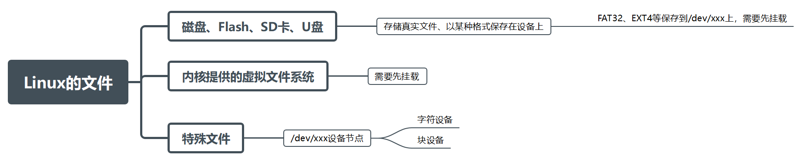
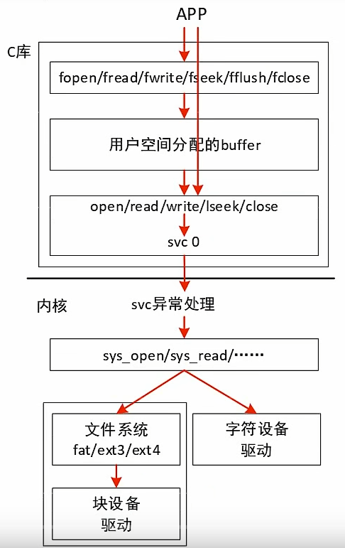
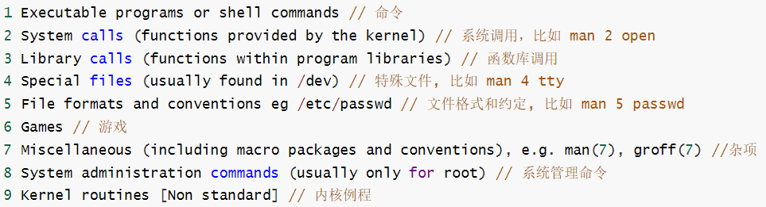
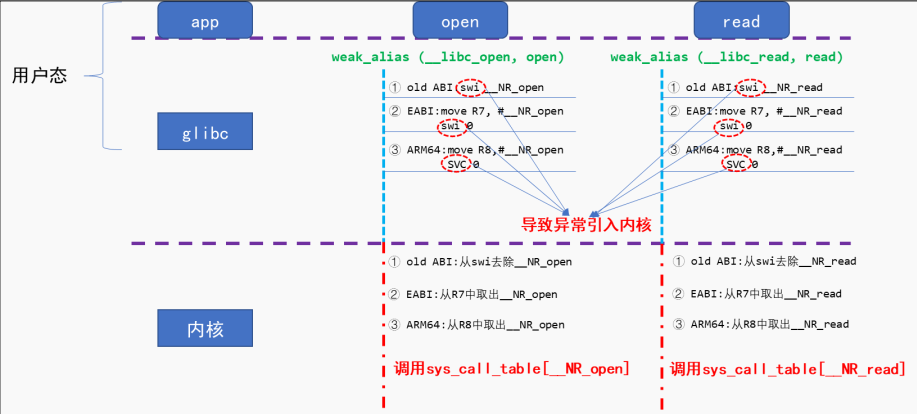
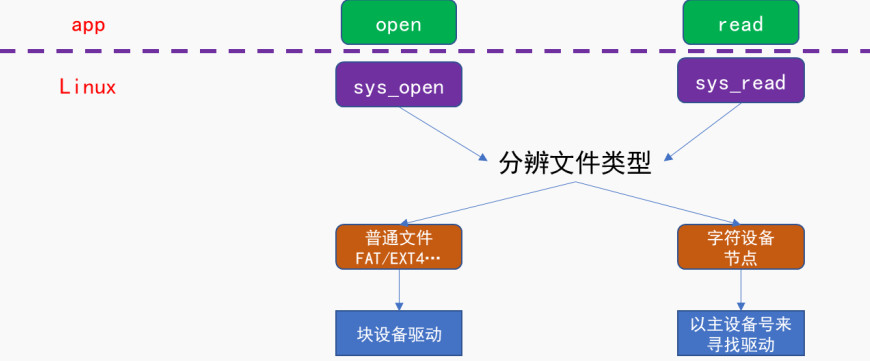

# 2025.5.8

Linux学习日记之文件

在 Linux 系统中，一切都是“ 文件”：普通文件、驱动程序、网络通信等等。所有的操作，都是通过“文件 IO”来操作的。所以，很有必要掌握文件操作的常用接口。  

一、文件从哪里来


注：

1. 通过挂载，用户可以通过访问挂载点目录来读写存储设备中的文件；

2. Linux通过目录树管理所有文件，挂载使得不同设备的文件系统能无缝集成到统一的路径中，用户无需关心物理设备细节

3. 挂载的步骤
   ```c
   1.确认设备：使用lsblk或fdisk -l查看设备名称（如/dev/sdb1） 
   2.创建挂载点：需为空目录：
   mkdir /mnt/mydisk
   3.执行挂载：
   mount /dev/sdb1 /mnt/mydisk
   ```

二、怎么访问文件


1. 系统调用（System Calls）是用户空间与内核交互的接口,
   系统调用IO的相关函数： open/read/write/lseek/fsync/close
   标准IO的相关函数：fopen/fread/fwrite/fseek/fflush/fclose

2. 如何知道这些函数的用法

   * Linux 下有 3 大帮助方法： help、 man、 info  
   * `--help`只能用于查看某个命令的用法
   * `map`既可以查看命令的用法，还可以查看函数的详细介绍等等
     

   * `info`手册比map手册更全面一些，也更难用

3. 系统调用函数怎么进入内核（open和read举例）
   

   * 用户态：参数和系统调用号存入寄存器，触发 `syscall`/`int 0x80`。

   * 内核态：保存上下文→查表调用 `sys_xxx`→处理请求→恢复上下文返回。

   * 安全隔离：通过 CPU 特权级和内核栈实现用户态与内核态的严格分离

4. 内核的 sys_open、 sys_read 会做什么？
     

5. 其他小知识

   * errno是全局的整数，可以给系统报错，需要包含`#include <errno.h>` 简单用法就是`perrno("string")` 会在终端上打印你写的字符串后面加上冒号和错误信息
   * 用open创建的文件的mode 是 `mode & ~umask`，得到的mode才是最终的权限，==系统的保护措施== 并且在此权限上使用`chmod`也改变不了
   * read函数返回值是已读取的字节，等于0说明读到尾部了
   * hexdump -C 文件  可以查看16进制的数据
   * 每个文件都有个头部以此来确定编码格式，对于UTF-8编码的文件，它的前面3个字符是 0xef 0xbb 0xbf；
   * 文件数据处理一般都是读取原始文件（只读），然后处理数据并写入到新文件（可读可写）内
   * 如何判断已经读完一行? 读到0x0d, 0x0a  因为回车换行的hex就是 `0d 0a`
   * `%[^,]`是C语言中scanf函数的一个正则表达式格式，用于读取字符串直到遇到指定的分隔符，这里就是遇到逗号
   * 文件操作符的0号1号2号分别对应了stdin（标准输入）、stdout（标准输出）、stderr（标准错误）
   * 每个进程都有自己的肚子的文件操作符空间，有时会出现打开不同的文件，文件操作符是一样的，因为他们处于不同的进程

6. 内核函数

   * ```c
     /*sscanf()
     *字符串解析函数，用于从字符串中按照指定格式提取数据
     *成功时返回成功匹配并赋值的参数个数。
     *失败时返回 0 或 -EINVAL（无效参数）
     */
     #include <linux/kernel.h>
     int sscanf(const char *buf, const char *fmt, ...);
     ```

   * ```c
     /*perror()
     *参数 s：可选的自定义字符串，会与系统错误信息拼接输出
     *errno 是一个全局变量（实际可能是线程安全的宏），存储最近一次系统/库函数调用的错误码
     */
     #include <stdio.h>  // 基本头文件
     #include <errno.h>  // 定义 errno 变量
     void perror(const char *s);  // s 为自定义前缀字符串
     ```

   * ```c
     //open() - 打开或创建文件
     函数原型:
     #include <fcntl.h>
     #include <sys/stat.h>
     int open(const char *pathname, int flags, mode_t mode);
     参数:
     pathname：文件路径。
     flags：打开方式（必选 O_RDONLY、O_WRONLY、O_RDWR，可选 O_CREAT、O_TRUNC、O_APPEND 等）。
     mode（仅当 O_CREAT 时有效）：文件权限（如 0644）。
     返回值:
     成功：返回文件描述符（fd，非负整数）。
     失败：返回 -1，并设置 errno。
     示例:
     int fd = open("file.txt", O_RDWR | O_CREAT, 0644);
     if (fd == -1) {
         perror("open failed");
         exit(1);
     }
     ```

   * ```c
     //read() - 从文件读取数据
     函数原型:
     #include <unistd.h>
     ssize_t read(int fd, void *buf, size_t count);
     参数:
     fd：文件描述符。
     buf：存储读取数据的缓冲区。
     count：要读取的字节数。
     返回值:
     成功：返回实际读取的字节数（可能小于 count）。
     文件结束（EOF）：返回 0。
     失败：返回 -1，设置 errno。
     示例:
     char buf[1024];
     ssize_t bytes_read = read(fd, buf, sizeof(buf));
     if (bytes_read == -1) {
         perror("read failed");
     }
     ```

   * ```c
     //write() - 向文件写入数据
     函数原型:
     #include <unistd.h>
     ssize_t write(int fd, const void *buf, size_t count);
     参数:
     fd：文件描述符。
     buf：待写入数据的缓冲区。
     count：要写入的字节数。
     返回值:
     成功：返回实际写入的字节数（可能小于 count）。
     失败：返回 -1，设置 errno。
     示例:
     const char *msg = "Hello, Linux!";
     ssize_t bytes_written = write(fd, msg, strlen(msg));
     if (bytes_written == -1) {
         perror("write failed");
     }
     ```

   * ```c
     //lseek() - 移动文件读写指针
     函数原型:
     #include <unistd.h>
     off_t lseek(int fd, off_t offset, int whence);
     参数:
     fd：文件描述符。
     offset：偏移量（可正可负）。
     whence：
     SEEK_SET：从文件开头偏移。
     SEEK_CUR：从当前位置偏移。
     SEEK_END：从文件末尾偏移。
     返回值:
     成功：返回新的文件指针位置（从文件开头计算的字节数）。
     失败：返回 -1，设置 errno。
     示例:
     // 移动到文件开头后第 100 字节
     off_t pos = lseek(fd, 100, SEEK_SET);
     if (pos == -1) {
         perror("lseek failed");
     }
     ```

   * ```c
     //fsync() - 强制将文件数据刷入磁盘
     函数原型:
     #include <unistd.h>
     int fsync(int fd);
     功能:
     确保文件的修改（包括数据和元数据）写入磁盘，避免数据丢失。
     返回值:
     成功：返回 0。
     失败：返回 -1，设置 errno。
     示例:
     if (fsync(fd) == -1) {
         perror("fsync failed");
     }
     ```

   * ```c
     //close() - 关闭文件描述符
     函数原型:
     #include <unistd.h>
     int close(int fd);
     功能:
     释放文件描述符 fd，避免资源泄漏。
     返回值:
     成功：返回 0。
     失败：返回 -1，设置 errno。
     示例:
     if (close(fd) == -1) {
         perror("close failed");
     }
     ```

     

https://github.com/Cutezzh/Linux_Notes.git
