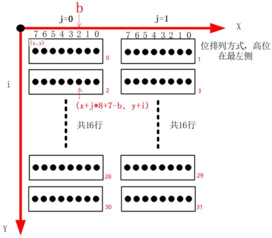

# 一、Framebuffer应用编程

在 Linux 系统中通过 Framebuffer 驱动程序来控制 LCD。 Frame 是帧的意思， buffer 是缓冲的意思，这意味着 Framebuffer 就是一块内存，里面保存着一帧图像  

## LCD 操作原理
1. **核心概念：Framebuffer（帧缓冲）**
   - **物理本质**：一块连续的内存区域，每个字节对应LCD屏幕的一个像素颜色值。
   - **显示流程**：
     1. 驱动程序初始化时，分配Framebuffer内存。
     2. LCD控制器自动从Framebuffer读取数据，转换为屏幕信号。
     3. 应用程序修改Framebuffer内存 → 屏幕内容实时更新。
2. **驱动程序的核心任务**
   - **配置硬件参数**：根据LCD屏幕手册设置时序（如分辨率、刷新率）、信号极性（如VSYNC高/低电平有效）。
   - **分配内存**：为Framebuffer分配物理连续的内存（通常通过`dma_alloc_coherent`函数）。
   - **注册设备**：生成设备文件（如`/dev/fb0`），供应用程序访问。
3. **应用程序的核心任务**
   - **获取屏幕参数**：分辨率、色深（BPP，Bits Per Pixel）。
   - **内存映射**：将Framebuffer映射到用户空间，直接操作像素。
   - **绘制图形**：向映射的内存写入颜色值，控制屏幕显示。

## 涉及的API函数

1. **`ioctl`函数**

   - **作用**：不同的驱动程序内部会实现不同的 ioctl， APP 可以使用各种 ioctl 跟驱动程序交互：可以传数据给驱动程序，也可以从驱动程序中读出数据  

   - **函数原型**：

     ```c
     #include <sys/ioctl.h>
     int ioctl(int fd, unsigned long request, ...);
     ```

   - **重要参数**：

     - `fd`表示文件描述符；
     - `request`表示与驱动程序交互的命令， 用不同的命令控制驱动程序输出我们需要的数据；
     - `…`表示可变参数 arg， 根据 request 命令，设备驱动程序返回输出的数据;
     - 返回值： 打开成功返回文件描述符，失败将返回-1。

2. **`mmap`函数**

   - **作用**：将Framebuffer内存映射到用户空间，直接读写像素。

   - **函数原型**：

     ```c
     #include <sys/mman.h>
     void *mmap(void *addr, size_t length, int prot, int flags,int fd, off_t offset);
     ```

   - **重要参数**：

     * `addr` 表示指定映射的內存起始地址，通常设为`NULL `表示让系统自动选定地址， 并在成功映射后返回该地址；

     * `length` 表示将文件中多大的内容映射到内存中；

     * `prot` 表示映射区域的保护方式，可以为以下 4 种方式的组合
       PROT_EXEC 映射区域可被执行
       PROT_READ 映射区域可被读出
       PROT_WRITE 映射区域可被写入
       PROT_NONE 映射区域不能存取

     * `Flags` 表示影响映射区域的不同特性，常用的有以下两种

       MAP_SHARED 表示对映射区域写入的数据会复制回文件内，原来的文件会改变
       MAP_PRIVATE 表示对映射区域的操作会产生一个映射文件的复制， 对此区域的任何修改都不会写回原来的文件内容中

     * 返回值： 若成功映射，将返回指向映射的区域的指针，失败将返回-1。

## 总结

Linux下操作LCD的核心是**通过`ioctl`获取参数，用`mmap`映射内存，直接修改像素值**。驱动程序负责底层硬件初始化，应用程序只需关注像素数据的读写

# 二、文字显示

## 字符的编码格式

1. ASCII：一个字节的 7 位就可以表示 128 个数值，在 ASCII 码中最高位永远是 0  
2. ANSI：ASCII 的扩展，向下包含 ASCII。对于 ASCII 字符仍以一个字节来表示，对于非 ASCII 字符则使用 2 字节来表示 ；同样的编码，字符集不一样显示的字符不一样
3. UNICODE：对于地球上任意一个字符，都给它一个唯一的数值
   * 使用 3 个字节表示一个 UNICODE  ：可以但是很浪费
   * UCS-2 Little endian/UTF-16 LE  ：小字节序 文件开头“ 0xff 0xfe”  
   * UCS-2 Big endian/UTF-16 BE ： 大字节序  文件开头“ 0xfe 0xff”  
   * UTF8  ：对于其中的 ASCII 字符，在 UTF8 文件中直接用其 ASCII 码来表示 ；对于非 ASCII 字符，使用变长的编码：每一个字节的高位都自带长度信息  （不带包头和带包头“0xef 0xbb 0xbf”所谓的BOOM）  

## 点阵显示

编译程序时，可以使用以下的选项告诉编译器C程序的编码方式是什么，GCC默认是UTF-8

```c
-finput-charset=GB2312
-finput-charset=UTF-8
```

对于编译出来的可执行程序，可以指定它里面的字符是以什么方式编码  

```c
-fexec-charset=GB2312
-fexec-charset=UTF-8
```

HZK16 这个文件，它是常用汉字的 16*16 点阵字库  每个汉字使用 32 字节来描述


区位码从 0xa1 而不是从 0 开始，是为了兼容 ASCII 码。每个区位有94个汉字，比如一个汉字的 GB2312 编码是 d6d0，它是 HZK16 里第“ (0xd6-0xa1)*94+(0xd0-0xa1)”个字符

## Freetype

Freetype 是开源的字体引擎库， 它提供统一的接口来访问多种字体格式文件，从而实现矢量字体显示。

一个文字的显示过程可以概括如下：
\-给定一个字符可以确定它的编码值(ASCII、 UNICODE、 GB2312)；
\-设置字体大小；
\-根据编码值，从文件头部中通过 charmap 找到对应的关键点(glyph)，它会根据字体大小调整关键点；
\-把关键点转换为位图点阵；
\-在 LCD 上显示出来

1. 编译程序时去哪找头文件？
   系统目录：就是交叉编译工具链里的某个 include 目录；也可以自己指定：编译时用 “ -I dir ”选项指定。

2. 链接时去哪找库文件？
   系统目录：就是交叉编译工具链里的某个 lib 目录；也可以自己指定：链接时用 “ -L dir ”选项指定。

3. 运行时去哪找库文件？
   系统目录：就是板子上的/lib、/usr/lib 目录；也可以自己指定：运行程序用环境变量 LD_LIBRARY_PATH 指定。`export LD_LIBRARY_PATH=/xxx_dir ; ./test`

4. 运行时不需要头文件，所以头文件不用放到板子上

5. `echo 'main(){}'| arm-buildroot-linux-gnueabihf-gcc -E -v -`它会列出头文件目录、库目录(LIBRARY_PATH)，看自己的工具链是啥改一下就行

6. 如果交叉编辑工具链里面有 configure的话，交叉编译程序的万能命令如下：
   ```shell
   ./configure --host=arm-buildroot-linux-gnueabihf --prefix=$PWD/tmp
   make
   make install
   ```


