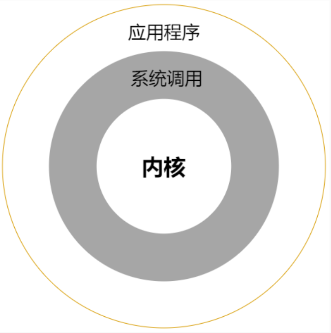

### 系统调用

1. 系统调用（system call）其实是 Linux 内核提供给应用层的应用编程接口（API），是 Linux 应用层进入内核的入口。  

2. 嵌入式Linux硬件平台，编程分为裸机编程、Linux驱动编程和Linux应用编程
3. 驱动程序属于内核的一部分，当操作系统启动的时候会加载驱动程序
4. 有操作系统支持，应用程序处于用户态，而驱动程序处于内核态，与纯粹的裸机程序存在着质的区别  

### 库函数

1. 库函数是属于应用层，运行在用户空间，通常是有缓存的
2. 系统调用是内核提供给应用层的编程接口，会从用户空间陷入到内核空间，并且是无缓存的
3. 库函数在不同操作系统之间相比于系统调用具有更好的可移植性
4. 应用编程简单点来说就是：开发 Linux 应用程序，通过调用内核提供的==系统调用==或==使用 C 库函数==来==开发==具有相应功能的==应用程序==  

### 标准C语言函数库

1. Linux系统下，使用的C语言库为GNU C语言函数库（glibc）
2. C语言库是以动态库文件的形式提供，通常存放在/lib 目录，它的命名方式通常是libc.so.6，不过这个是一个软链接文件，它会链接到真正的库文件

### main函数

1. 分为无传参【int main(void) {}】和传参【int main(int argc, char **argv) {}】

