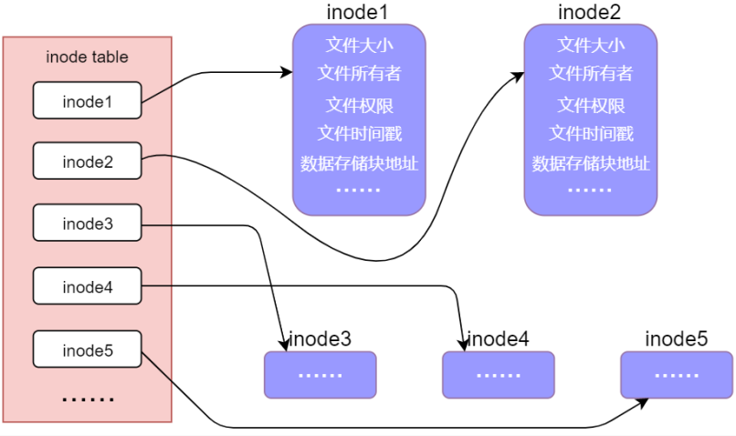

### Linux系统如何管理文件

1. 磁盘分为两个区域：数据区和inode区
   
2. 打开一个文件，系统内部会将这个过程分为三步：
   \* 系统找到这个文件名所对应的 inode 编号
   \* 通过 inode 编号从 inode table 中找到对应的 inode 结构体
   \* 根据 inode 结构体中记录的信息，确定文件数据所在的 block，并读出数据  
3. 内核会为每个进程设置一个专门的数据结构用于管理该进程，称为进程控制块（PCB)
   
4. inode 数据结构体中的元素会记录该文件的数据存储的 block（块），也就是说可以通过 inode 找到文件数据存在在磁盘设备中的那个位置，从而把文件数据读取出来  

### 返回错误处理与errno

1. 每一个进程（程序）都维护了自己的 errno 变量，它是程序中的全局变量，该变量用于存储就近发生的函数执行错误编号  

2. strerror 函数
   函数原型

   ```c
   #include <string.h>
   char *strerror(int errnum);
   ```

   errnum： 错误编号 errno。

   返回值： 对应错误编号的字符串描述信息

3. perror 函数
   函数原型

   ```c
   #include <stdio.h>
   void perror(const char *s);
   ```

   S：在错误提示字符串信息之前，可加入自己的打印信息，也可不加，不加则传入空字符串即可  

### exit、\_exit、\_Exit

1. 在 Linux 系统下，进程正常退出除了可以使用 return 之外，还可以使用 exit()、 \_exit()以及\_Exit() 

2. \_exit和\_Exit（系统调用）
   函数原型

   ```c 
   #include <unistd.h>
   void _exit(int status);
   
   #include <stdlib.h>
   void _Exit(int status);
   //两者用法作用一样
   ```

   status 状态标志， 0 表示正常结束、若为其它值则表示程序执行过程中检测到有错误发生  

3. exit（标准C库函数）
   函数原型

   ```c
   #include <stdlib.h>
   void exit(int status);
   ```

### 空洞文件

1. 通过lseek系统调用将该文件的读写偏移量移动到了比文件大小还大的地方，中间这段区域成为文件空洞，不占用任何物理内存，直到对空洞部分写入数据才会分配物理空间，逻辑上文件的大小是包含了空洞部分的大小 
2. 应用场景1：多线程下载时就可以从不同的地址同时写入，就达到了多线程的优势 
3. 应用场景2：创建虚拟机时，分配了100G ，但实际只占了几G的磁盘空间，只有用的时候才会分配
4. ls 命令查看到的大小是文件的逻辑大小，包括了空洞部分和真实数据部分；du 命令查看到的大小是文件实际占用存储块的大小

### O\_APPEND 和 O\_TRUNC 标志

1. 如果使用了O\_TRUNC  标志，调用 open 函数打开文件的时候会将文件原本的内容全部丢弃，文件大小变为 0  
2. O\_APPEND 标志会自动把文件当前位置偏移量移动到文件末尾，从文件末尾开始写入数据，也就是意味着每次写入数据都是从文件末尾开始  
3. O\_APPEND 标志不会影响==读文件==，读文件位置偏移量默认情况下依然是文件头
4. O\_APPEND 标志，即使是通过 lseek 函数也是无法修改==写文件==时对应的位置偏移量，依然是从文件末尾开始  

### 多次打开同一个文件

1. 一个进程内多次 open 打开同一个文件，那么会得到多个不同的文件描述符 fd，同理在关闭文件的时候也需要调用close 依次关闭各个文件描述符
2. 调用 open 函数打开文件使用的是什么权限，则返回的文件描述符就拥有什么权限  
3. 一个进程内多次 open 打开同一个文件，在内存中并不会存在多份动态文件。
4. open 函数的时候，会将文件数据（文件内容）从磁盘等块设备读取到内存中，将文件数据在内存中进行维护，内存中的这份文件数据我们就把它称为动态文件    
5. 一个进程内多次 open 打开同一个文件，不同文件描述符所对应的读写位置偏移量是相互独立的
6. 当文件的引用计数（记录了当前文件被多少个文件描述符 fd 关联）为 0 时，系统会自动将动态文件关闭    

### 复制文件描述符

1. 在 Linux 系统下，可以使用 dup 或 dup2 这两个系统调用对文件描述符进行复制，复制得到的文件描述符与旧的文件描述符都指向了同一个文件表

2. dup函数
   函数原型

   ```c  
   #include <unistd.h>
   int dup(int oldfd);
   ```

   oldfd： 需要被复制的文件描述符。
   返回值： 成功时将返回一个新的文件描述符，由操作系统分配；如果复制失败将返回-1，并且会设置 errno 值

3. dup2 函数
   函数原型

   ```c
   #include <unistd.h>
   int dup2(int oldfd, int newfd);
   ```

   oldfd： 需要被复制的文件描述符。
   newfd： 指定一个文件描述符（需要指定一个当前进程没有使用到的文件描述符）。
   返回值： 成功时将返回一个新的文件描述符，也就是手动指定的文件描述符newfd；如果复制失败将返回-1，并且会设置 errno 值。

4. 文件描述符并不是只能复制一次，实际上可以对同一个文件描述符 fd 调用 dup 或 dup2 函数复制多次，得到多个不同的文件描述符  

### 文件共享

1. 同一个进程中多次调用 open 函数打开同一个文件，如下
   
2. 不同进程中分别使用 open 函数打开同一个文件，如下
   
3. 同一个进程中通过 dup（dup2）函数对文件描述符进行复制，如下
   

### 原子操作与竞争冒险

1. 竞争冒险：操作共享资源的两个进程（或线程），其操作之后的所得到的==结果往往是不可预期==的，因为每个进程（或线程）去操作文件的==顺序是不可预期的==，即这些进程获得 CPU 使用权的先后顺序是不可预期的，完全由操作系统调配  

2. 原子操作：要么一步也不执行，一旦执行，必须要执行完所有步骤，不可能只执行所有步骤中的一个子集

3. ==O\_APPEND 标志实现原子操作==，不管怎么写入数据都会是从文件末尾写，这样就不会导致出现“进程 A 写入的数据覆盖了进程 B 写入的数据”  的情况

4. ==pread()和 pwrite()实现原子操作==，调用 pread /pwrite相当于调用 lseek 后再调用 read/write

5. pread、 pwrite 
   函数原型

   ```c  
   #include <unistd.h>
   ssize_t pread(int fd, void *buf, size_t count, off_t offset);
   ssize_t pwrite(int fd, const void *buf, size_t count, off_t offset);
   ```

   fd、 buf、 count 参数与 read 或 write 函数意义相同。
   offset： 表示当前需要进行读或写的位置偏移量。

   返回值： 返回值与 read、 write意义一样

### fcntl 和 ioctl

1. fcntl 函数 
   函数原型

   ```c
   #include <unistd.h>
   #include <fcntl.h>
   int fcntl(int fd, int cmd, ... /* arg */ )
   ```

   cmd：操作命令

   | cmd                                | 说明                    |
   | ---------------------------------- | ----------------------- |
   | cmd=F_DUPFD 或 cmd=F_DUPFD_CLOEXEC | 复制文件描述符          |
   | cmd=F_GETFD 或 cmd=F_SETFD         | 获取/设置文件描述符标志 |
   | cmd=F_GETFL 或 cmd=F_SETFL         | 获取/设置文件状态标志   |
   | cmd=F_GETOWN 或 cmd=F_SETOWN       | 获取/设置异步 IO 所有权 |
   | cmd=F_GETLK 或 cmd=F_SETLK         | 获取/设置记录锁         |

   返回值：执行失败情况下，返回-1，并设置 errno；成功的情况下，其返回值与 cmd有关，文件描述符、文件状态标志等等

2. ioctl 函数
   函数原型

   ```c 
   #include <sys/ioctl.h>
   int ioctl(int fd, unsigned long request, ...);
   ```

   request： 此参数与具体要操作的对象有关，没有统一值，表示向文件描述符请求相应的操作 
   返回值： 成功返回 0，失败返回-1  

### 截断文件

1. truncate()或 ftruncate()可将普通文件截断为指定字节长度  

2. 函数原型
   ```c
   #include <unistd.h>
   #include <sys/types.h>
   int truncate(const char *path, off_t length);
   int ftruncate(int fd, off_t length);
   ```

   ftruncate()使用文件描述符 fd 来指定目标文件，而 truncate()则直接使用文件路径 path 来指定目标文件，其功能一样  

3. 文件大小大于参数 length，则多余的数据将被丢失；如果文件大小小于参数 length 所指定的大小，则将其进行扩展，对扩展部分进行读取将得到空字节"\0"