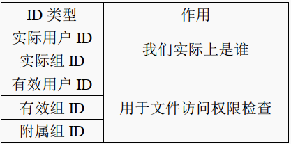
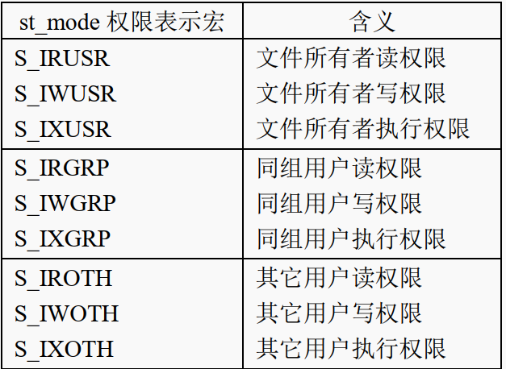
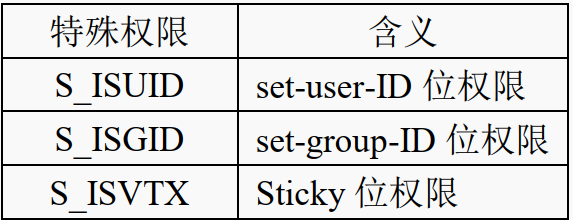
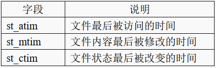
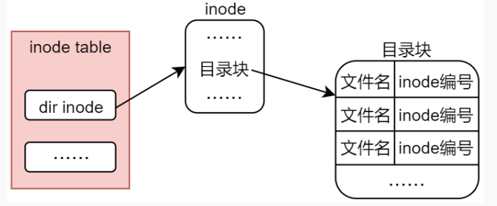

### Linux系统中的文件类型

Linux 下一切皆文件，文件作为 Linux 系统设计思想的核心理念，在 Linux 系统下显得尤为重要。 

在 Linux 系统下，可以通过 stat 命令或者 ls 命令来查看文件类型

| 文件类型 |     说明     |
| :------: | :----------: |
|  ' - '   |   普通文件   |
|  ' d '   |   目录文件   |
|  ' c '   | 字符设备文件 |
|  ' b '   |  块设备文件  |
|  ' l '   | 符号链接文件 |
|  ' s '   |  套接字文件  |
|  ' p '   |   管道文件   |

**普通文件（regular file）**

普通文件可以分为两大类：文本文件和二进制文件  

文本文件： 文件中的内容是由文本构成的，所谓文本指的是 ASCII 码字符。.c、 .h、 .sh、 .txt 等  

二进制文件： 二进制文件中存储的本质上也是数字，这些数字并不是文本字符编码，而是真正的数字。.bin/.o等

**目录文件（directory）**

目录就是文件夹，文件夹在 Linux 系统中也是一种文件，是一种特殊文件。  

文件夹中记录了该文件夹本身的路径以及该文件夹下所存放的文件，不适合文件 I/O 的方式来读写。

**字符设备文件和块设备文件（character/block）**

设备文件不存在于磁盘中，而是由文件系统虚拟出来的，一般是由内存来维护

Linux 系统中，可将硬件设备分为字符设备和块设备，所以就有了字符设备文件和块设备文件两种文件类型    

字符设备文件一般存放在 Linux 系统/dev/目录下，所以/dev 也称为虚拟文件系统 devfs  

**符号链接文件（link）**

符号链接文件（link）类似于 Windows 系统中的快捷方式文件，是一种特殊文件，它的内容指向的是另一个文件路径  

**管道文件（pipe）**

管道文件主要用于进程间通信  

**套接字文件（socket）**

套接字文件（socket）也是一种进程间通信的方式，与管道文件不同的是，它们可以在不同主机上的进程间通信，实际上就是网络通信  

### stat函数

```c
#include <sys/types.h>
#include <sys/stat.h>
#include <unistd.h>
int stat(const char *pathname, struct stat *buf);
//pathname： 用于指定一个需要查看属性的文件路径。
//buf： struct stat 类型指针，用于指向一个 struct stat 结构体变量。
//返回值： 成功返回 0；失败返回-1，并设置 error。
```

**struct stat 结构体**  

```c
struct stat
{
    dev_t st_dev; /* 文件所在设备的 ID */
    ino_t st_ino; /* 文件对应 inode 节点编号 */
    mode_t st_mode; /* 文件对应的模式 */
    nlink_t st_nlink; /* 文件的链接数 */
    uid_t st_uid; /* 文件所有者的用户 ID */
    gid_t st_gid; /* 文件所有者的组 ID */
    dev_t st_rdev; /* 设备号（指针对设备文件） */
    off_t st_size; /* 文件大小（以字节为单位） */
    blksize_t st_blksize; /* 文件内容存储的块大小 */
    blkcnt_t st_blocks; /* 文件内容所占块数 */
    struct timespec st_atim; /* 文件最后被访问的时间 */
    struct timespec st_mtim; /* 文件内容最后被修改的时间 */
    struct timespec st_ctim; /* 文件状态最后被改变的时间 */
};
```

**st_mode 变量**  

该变量记录了文件的类型、文件的权限这些信息，都是==八进制==记录的


```c
O 对应的 3 个 bit 位用于描述其它用户的权限；
G 对应的 3 个 bit 位用于描述同组用户的权限；
U 对应的 3 个 bit 位用于描述文件所有者的权限；
S 对应的 3 个 bit 位用于描述文件的特殊权限
```

文件类型通过4个bit位数据判断

```c
S_IFSOCK 0140000 socket（套接字文件）
S_IFLNK 0120000 symbolic link（链接文件）
S_IFREG 0100000 regular file（普通文件）
S_IFBLK 0060000 block device（块设备文件）
S_IFDIR 0040000 directory（目录）
S_IFCHR 0020000 character device（字符设备文件）
S_IFIFO 0010000 FIFO（管道文件）
```

除了这样判断之外，我们还可以使用 Linux 系统封装好的宏来进行判断，如下所示（m 是 st_mode 变量）：  

```c
S_ISREG(m) //判断是不是普通文件，如果是返回 true，否则返回 false
S_ISDIR(m) //判断是不是目录，如果是返回 true，否则返回 false
S_ISCHR(m) //判断是不是字符设备文件，如果是返回 true，否则返回 false
S_ISBLK(m) //判断是不是块设备文件，如果是返回 true，否则返回 false
S_ISFIFO(m) //判断是不是管道文件，如果是返回 true，否则返回 false
S_ISLNK(m) //判断是不是链接文件，如果是返回 true，否则返回 false
S_ISSOCK(m) //判断是不是套接字文件，如果是返回 true，否则返回 false
```

**struct timespec 结构体**    

```c
#include <time.h>
struct timespec
{
    time_t tv_sec; /* 秒 */
    syscall_slong_t tv_nsec; /* 纳秒 */
};
```

time_t 时间指的是一个时间段，从某一个时间点到某一个时间点所经过的秒数 ，在 Linux下被称为日历时间  

### fstat 和 lstat 函数

**fstat 函数**  

```c
#include <sys/types.h>
#include <sys/stat.h>
#include <unistd.h>
int fstat(int fd, struct stat *buf);
```

fstat 与 stat 区别在于， stat 是从文件名出发得到文件属性信息，不需要先打开文件；而 fstat 函数则是从文件描述符出发得到文件属性信息，所以使用 fstat 函数之前需要先打开文件得到文件描述符  

**lstat 函数**  

```c
#include <sys/types.h>
#include <sys/stat.h>
#include <unistd.h>
int lstat(const char *pathname, struct stat *buf);
```

lstat()与 stat、 fstat 的区别在于，对于符号链接文件， stat、 fstat 查阅的是符号链接文件所指向的文件对应的文件属性信息，而 lstat 查阅的是符号链接文件本身的属性信息  

### 文件属主

Linux 是一个多用户操作系统，系统中一般存在着好几个不同的用户，而 Linux 系统中的每一个文件都有一个与之相关联的用户和用户组，通过这个信息可以判断文件的所有者和所属组。  

用户 ID 简称 UID、用户组 ID 简称 GID  

对于**进程**来说亦是如此



实际用户 ID 和实际组 ID 标识我们究竟是谁，也就是执行该进程的用户是谁、以及该用户对应的所属组；实际用户 ID 和实际组 ID 确定了进程所属的用户和组  

**有效用户 ID 和有效组 ID**

对于有效用户 ID 和有效组 ID 来说，这是进程所持有的概念，对于文件来说，并无此属性  

当进行权限检查时，并不是通过进程的实际用户和实际组来参与权限检查的，而是通过有效用户和有效组来参与文件权限检查  

**chown 函数**  

```c
#include <unistd.h>
int chown(const char *pathname, uid_t owner, gid_t group);
//pathname： 用于指定一个需要修改所有者和所属组的文件路径。
//owner： 将文件的所有者修改为该参数指定的用户（以用户 ID 的形式描述）；
//group： 将文件的所属组修改为该参数指定的用户组（以用户组 ID 的形式描述）；
//返回值： 成功返回 0；失败将返回-1，兵并且会设置 errno。
```

```c
#include <unistd.h>
#include <sys/types.h>
uid_t getuid(void);
gid_t getgid(void);
//getuid 和 getgid 两个系统调用分别用于获取当前进程的实际用户 ID 和实际组 ID
```

### 文件访问权限

**普通权限**



**特殊权限**



set-user-ID 位权限被设置，该进程直接获取了文件所有者的权限、以文件所有者的身份操作该文件

set-group-ID 位权限被设置，该进程直接获取了文件所属组成员的权限、以文件所属组成员的身份操作该文件

**目录权限**

如果需要对文件进行读、写或执行等操作，不光是需要拥有该文件本身的读、写或执行权限，还需要拥有文件所在目录的执行权限  

**检查文件权限 access**   

 ```c
 #include <unistd.h>
 int access(const char *pathname, int mode);
 //pathname： 需要进行权限检查的文件路径
 /*
 mode： 该参数可以取以下值：
 F_OK：检查文件是否存在
 R_OK：检查是否拥有读权限
 W_OK：检查是否拥有写权限
 X_OK：检查是否拥有执行权限
 */
 //返回值： 检查项通过则返回 0，表示拥有相应的权限并且文件存在；否则返回-1，如果多个检查项组合在一起，只要其中任何一项不通过都会返回-1
 ```

**修改文件权限 chmod**  

```c
#include <sys/stat.h>
int chmod(const char *pathname, mode_t mode);
//pathname： 需要进行权限修改的文件路径，若该参数所指为符号链接，实际改变权限的文件是符号链接所指向的文件，而不是符号链接文件本身。
//mode： 该参数用于描述文件权限，可以直接使用八进制数据来描述，也可以使用相应的权限宏（单个或通过位或运算符" | "组合）。
//返回值： 成功返回 0；失败返回-1，并设置 errno。

#include <sys/stat.h>
int fchmod(int fd, mode_t mode);
//fchmod()与 chmod()的区别在于使用了文件描述符来代替文件路径
```

**umask 函数** 

```c 
#include <sys/types.h>
#include <sys/stat.h>
mode_t umask(mode_t mask);
//mask： 需要设置的权限掩码值，既可以使用数字表示（譬如八进制数）也可以直接使用宏（S_IRUSR、 S_IWUSR 等）。
//返回值： 返回设置之前的 umask 值，也就是旧的 umask
```

umask命令用于查看/设置权限掩码，权限掩码主要用于对新建文件的权限进行屏蔽。

权限掩码的表示方式与文件权限的表示方式相同，但是需要去除特殊权限位， umask 不能对特殊权限位进行屏蔽。 

文件实际的权限并不等于 mode 参数所描述的权限，而是通过如下关系得到实际权限
```shell   
mode & ~umask
```

umask 是进程自身的一种属性、 A 进程的 umask 与 B 进程的 umask 无关（父子进程关系除外）  

### 文件的时间属性



**utime()、 utimes()修改时间属性**  

只能显式修改文件的最后一次访问时间和文件内容最后被修改的时间，不能显式修改文件状态最后被改变的时间  

```c
#include <sys/types.h>
#include <utime.h>
int utime(const char *filename, const struct utimbuf *times);
//filename： 需要修改时间属性的文件路径。
//times： 将时间属性修改为该参数所指定的时间值，如果将 times 参数设置为 NULL，则会将文件的访问时间和修改时间设置为系统当前时间。
//返回值： 成功返回值 0；失败将返回-1，并会设置 errno。

struct utimbuf {
    time_t actime; /* 访问时间 */
    time_t modtime; /* 内容修改时间 */
}
```

```c
#include <sys/time.h>
int utimes(const char *filename, const struct timeval times[2]);
//filename： 需要修改时间属性的文件路径。
//times： 将时间属性修改为该参数所指定的时间值，第一个元素用于指定访问时间，第二个元素用于指定内容修改时间，如果times 参数为 NULL，则会将文件的访问时间和修改时间设置为当前时间。
//返回值： 成功返回 0；失败返回-1，并且会设置 errno。

struct timeval {
    long tv_sec; /* 秒 */
    long tv_usec; /* 微秒 */
};
```

文件时间属性的修改也不是任何用户都可以随便修改的,只有以下进程可对其进行修改:

* 超级用户进程（以 root身份运行的进程）。

* 有效用户 ID 与该文件用户 ID（文件所有者）相匹配的进程。

* 在参数 times 等于 NULL 的情况下，对文件拥有写权限的进程。

**futimens()、 utimensat()修改时间属性**  

相比utime 和 utimes 函数有以下三个优点  

* 可按纳秒级精度设置时间戳  
* 可单独设置某一时间戳  
* 可独立将任一时间戳设置为当前时间  

```c
#include <fcntl.h>
#include <sys/stat.h>
int futimens(int fd, const struct timespec times[2]);
//fd： 文件描述符。
//times： 将时间属性修改为该参数所指定的时间值,第一个元素用于指定访问时间，第二个元素用于指定内容修改时间
//返回值： 成功返回 0；失败将返回-1，并设置 errno。
```

该函数的时间戳可以按下列 4 种方式之一进行指定  

* 如果 times 参数是NULL，将访问时间和修改时间都设置为当前时间 
* 任一数组元素的 tv_nsec字段的值设置为 UTIME_NOW，则表示相应的时间戳设置为当前时间
* 任一数组元素的 tv_nsec字段的值设置为 UTIME_OMIT，则表示相应的时间戳保持不变
*  tv_nsec 字段的值既不是UTIME_NOW 也不是 UTIME_OMIT,相应的时间戳设置为相应的 tv_sec 和 tv_nsec字段指定的值

```c
#include <fcntl.h>
#include <sys/stat.h>
int utimensat(int dirfd, const char *pathname, const struct timespec times[2], int flags);

//dirfd： 该参数可以是一个目录的文件描述符，也可以是特殊值 AT_FDCWD；如果 pathname 参数指定的是文件的绝对路径，则此参数会被忽略。
//pathname： 指定文件路径。
//times： 与 futimens()的 times 参数含义相同。
//flags ： 此参数可以为0 ，也可以设置为AT_SYMLINK_NOFOLLOW ，如果设置为AT_SYMLINK_NOFOLLOW，当 pathname 参数指定的文件是符号链接，则修改的是该符号链接的时间戳，而不是它所指向的文件。
//返回值： 成功返回 0；失败返回-1、并会设置时间戳。
```

### 符号链接与硬连接

在 Linux 系统中有两种链接文件，分为软链接（也叫符号链接）文件和硬链接文件  

```shell
硬链接： ln 源文件 链接文件
软链接： ln -s 源文件 链接文件  
```

**创建链接文件**  

**硬连接**

* 硬链接文件与源文件 test_file 都拥有相同的 inode 号  ,创建出来的硬链接文件与源文件对文件系统来说是完全平等的关系 。

* 当为文件每创建一个硬链接， inode 节点上的链接数就会加一，每删除一个硬链接， inode 节点上的链接数就会减一，直到为 0， inode 节点和对应的数据块才会被文件系统所回收  

```c
#include <unistd.h>
int link(const char *oldpath, const char *newpath);

//oldpath： 用于指定被链接的源文件路径，应避免 oldpath 参数指定为软链接文件，为软链接文件创建硬链接没有意义，虽然并不会报错。
//newpath： 用于指定硬链接文件路径，如果 newpath 指定的文件路径已存在，则会产生错误。
//返回值： 成功返回 0；失败将返回-1，并且会设置 errno。
```

**软连接**

* 软链接文件与源文件有着不同的 inode 号  
* 软链接文件的数据块中存储的是源文件的路径名，链接文件可以通过这个路径找到被链接的源文件

```c
#include <unistd.h>
int symlink(const char *target, const char *linkpath);

//target： 用于指定被链接的源文件路径， target 参数指定的也可以是一个软链接文件。
//linkpath： 用于指定硬链接文件路径，如果 newpath 指定的文件路径已存在，则会产生错误。
//返回值： 成功返回 0；失败将返回-1，并会设置 errno。
```

**读取软链接文件**

```c
#include <unistd.h>
ssize_t readlink(const char *pathname, char *buf, size_t bufsiz);
//pathname： 需要读取的软链接文件路径。只能是软链接文件路径，不能是其它类型文件，否则调用函数将报错。
//buf： 用于存放路径信息的缓冲区。
//bufsiz： 读取大小，一般读取的大小需要大于链接文件数据块中存储的文件路径信息字节大小。
//返回值：失败将返回-1，并会设置 errno；成功将返回读取到的字节数。
```

### 目录

**目录存储形式**  

对于目录来说，其存储形式则是由 inode 节点和目录块所构成，目录块当中记录了有哪些文件组织在这个目录下，记录它们的文件名以及对应的 inode 编号  



**创建和删除目录** 

  ```c
  #include <sys/stat.h>
  #include <sys/types.h>
  int mkdir(const char *pathname, mode_t mode);
  //pathname： 需要创建的目录路径。
  //mode： 新建目录的权限设置，设置方式与 open 函数的 mode 参数一样，最终权限为（mode & ~umask）。
  //返回值： 成功返回 0；失败将返回-1，并会设置 errno。
  ```

```c
#include <unistd.h>
int rmdir(const char *pathname);
//pathname： 需要删除的目录对应的路径名，并且该目录必须是一个空目录，也就是该目录下只有.和..这两个目录项
//返回值： 成功返回 0；失败将返回-1，并会设置 errno。
```

**打开、读取以及关闭目录**  

```c
#include <sys/types.h>
#include <dirent.h>
DIR *opendir(const char *name);
//name： 指定需要打开的目录路径名，可以是绝对路径，也可以是相对路径。
//返回值： 成功将返回指向该目录的句柄，一个 DIR 指针（其实质是一个结构体指针），其作用类似于open函数返回的文件描述符fd，后续对该目录的操作需要使用该DIR指针变量；若调用失败，则返回NULL。

#include <dirent.h>
struct dirent *readdir(DIR *dirp);
//dirp： 目录句柄 DIR 指针。
//返回值： 返回一个指向 struct dirent 结构体的指针
/*一旦遇到目录结尾或是出错， readdir()将返回 NULL,这时候就要判断error是不是0了，是0说明到目录结尾了*/
struct dirent {
    ino_t d_ino; /* inode 编号 */
    off_t d_off; /* not an offset; see NOTES */
    unsigned short d_reclen; /* length of this record */
    unsigned char d_type; /* type of file; not supported by all filesystem types */
    char d_name[256]; /* 文件名 */
};

#include <sys/types.h>
#include <dirent.h>
void rewinddir(DIR *dirp);
//dirp： 目录句柄。
/*将目录流重置为目录起点*/

#include <sys/types.h>
#include <dirent.h>
int closedir(DIR *dirp);
//dirp： 目录句柄。
//返回值： 成功返回 0；失败将返回-1，并设置 errno。
```

**进程的当前工作目录**  

Linux 下的每一个进程都有自己的当前工作目录（current working directory），当前工作目录是该进程解析、搜索相对路径名的起点  

一般情况下，运行一个进程时、其父进程的当前工作目录将被该进程所继承，成为该进程的当前工作目录。

```c  
/*获取进程的当前工作目录*/
#include <unistd.h>
char *getcwd(char *buf, size_t size);
//buf： getcwd()将内含当前工作目录绝对路径的字符串存放在 buf 缓冲区中。
//size： 缓冲区的大小，分配的缓冲区大小必须要大于字符串长度，否则调用将会失败。
//返回值： 如果调用成功将返回指向 buf 的指针，失败将返回 NULL，并设置 errno。

/*用于更改进程的当前工作目录*/
#include <unistd.h>
int chdir(const char *path);
int fchdir(int fd);
//path： 将进程的当前工作目录更改为 path 参数指定的目录，可以是绝对路径、也可以是相对路径，指定的目录必须要存在，否则会报错。
//fd： 将进程的当前工作目录更改为 fd 文件描述符所指定的目录（譬如使用 open 函数打开一个目录）。
//返回值： 成功均返回 0；失败均返回-1，并设置 errno。
```

chdir()是以路径的方式进行指定，而 fchdir()则是通过文件描述符  

### 删除文件

```c
/*删除一个文件（不包括目录）*/
#include <unistd.h>
int unlink(const char *pathname);
//pathname： 需要删除的文件路径，可使用相对路径、也可使用绝对路径，如果 pathname 参数指定的文件不存在，则调用 unlink()失败。
//返回值： 成功返回 0；失败将返回-1，并设置 errno。
```

- unlink()的作用与 link()相反， unlink()系统调用用于移除/删除一个硬链接（从其父级目录下删除该目录条目）  
- 只有当链接计数变为 0 时，该文件的内容才可被删除  
- 只要有进程打开了该文件，其内容也不能被删除  
- 若 pathname 指定的文件为软链接文件，则删除软链接文件本身，而非软链接所指定的文件。

```c
/*移除一个文件或空目录*/
#include <stdio.h>
int remove(const char *pathname);
//pathname： 需要删除的文件或目录路径，可以是相对路径、也可是绝对路径。
//返回值： 成功返回 0；失败将返回-1，并设置 errno。
```

- remove()不对软链接进行解引用操作  
- pathname 参数指定的是一个非目录文件，remove()调用 unlink()，指定目录， remove()调用 rmdir()  

### 文件重命名

```c
/*既可以对文件进行重命名，又可以将文件移至同一文件系统中的另一个目录下*/
#include <stdio.h>
int rename(const char *oldpath, const char *newpath);
//oldpath： 原文件路径。
//newpath： 新文件路径。
//返回值： 成功返回 0；失败将返回-1，并设置 errno。
```

- rename()调用仅操作目录条目，而不移动文件数据（不改变文件 inode 编号、不移动文件数据块中存储的内容）  
- 若 newpath 参数指定的文件或目录已经存在，则将其覆盖  
- 若 newpath 和 oldpath 指向同一个文件，则不发生变化  
- ename()系统调用对其两个参数中的软链接均不进行解引用  
- 如果 oldpath 指代文件，而非目录，那么就不能将 newpath 指定为一个目录的路径名，必须也包含新的文件名
- 如果 oldpath 指代为一个目录，在这种情况下， newpath 要么不存在，要么必须指定为一个空目录  
- oldpath 和 newpath 所指代的文件必须位于同一文件系统  
- 不能对.（当前目录）和..（上一级目录）进行重命名
