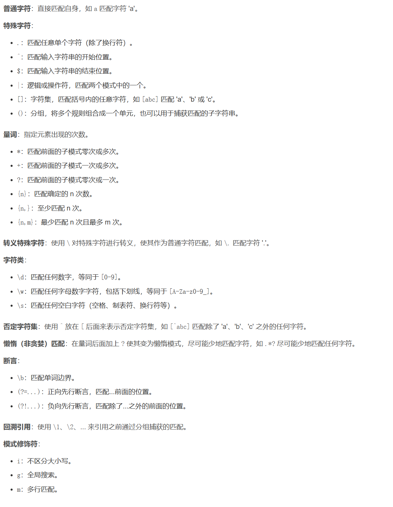

C 语言库函数中已经给我们提供了丰富的字符串处理相关函数，基本常见的字符串处理需求都可以直接使用这些库函数来实现，而不需要自己编写代码，使用这些库函数可以大大减轻编程负担。这些库函数大致可以分为字符串的输入、输出、合并、修改、比较、转换、复制、搜索等几类。

### 字符串输入/输出

**字符串输出**

常用的字符串输出函数有 putchar()、 puts()、 fputc()、 fputs()  

printf()可以按照自己规定的格式输出字符串信息，一般称为格式化输出  

```c
/*puts()函数用来向标准输出设备（屏幕、显示器）输出字符串并自行换行*/
#include <stdio.h>
int puts(const char *s);
//s： 需要进行输出的字符串
//返回值： 成功返回一个非负数；失败将返回 EOF， EOF 其实就是-1
```

```c
/*fputs()函数用于输出一条字符串*/
#include <stdio.h>
int fputs(const char *s, FILE *stream);
//s： 需要输出的字符串
//stream： 文件指针
//返回值： 成功返回非负数；失败将返回 EOF
```

puts()只能输出到标准输出设备，而 fputs()可把字符串输出到指定的文件中，既可以是标准输出、标准错误设备，也可以是一个普通文件  

```c
/*putchar()函数用于输出参数 c 指定的字符（一个无符号字符）:一个字符， 0~127 之间的对应的 ASCII 码，用 char 类型定义好的一个字符型变量*/
#include <stdio.h>
int putchar(int c);
//c： 需要进行输出的字符
//返回值： 出错将返回 EOF
```

putchar()输出可以是一个字符，可以是介于 0~127 之间的一个十进制整型数（包含 0 和 127，输出其对应的 ASCII 码字符），也可以是用 char 类型定义好的一个字符型变量  

```c
/*fputc()函数用于输出参数 c 指定的字符（一个无符号字符）*/
#include <stdio.h>
int fputc(int c, FILE *stream);
//c： 需要进行输出的字符
//stream： 文件指针
//返回值： 成功时返回输出的字符；出错将返回 EOF
```

与 putchar()区别在于， putchar()只能输出到标准输出设备，而 fputc()可把字符输出到指定的文件中，既可以是标准输出、标准错误设备，也可以是一个普通文件  

**字符串输入**

常用的字符串输入函数有 gets()、 getchar()、 fgetc()、 fgets()。  

与 printf()对应，在 C 库函数中同样也提供了格式化输入函数 scanf()。  

```c
/*gets()函数用于从标准输入设备（譬如键盘）中获取用户输入的字符串*/
#include <stdio.h>
char *gets(char *s);
//s： 指向字符数组的指针，用于存储字符串
//返回值： 如果成功，该函数返回指向 s 的指针；如果发生错误或者到达末尾时还未读取任何字符，则返回 NULL
```

用户从键盘输入的字符串数据首先会存放在一个输入缓冲区中， gets()函数会从输入缓冲区中读取字符串存储到字符指针变量 s 所指向的内存空间，当从输入缓冲区中读走字符后，相应的字符便不存在于缓冲区了。

输入的字符串中就算是有空格也可以直接输入，字符串输入完成之后按回车即可，gets()函数不检查缓冲区溢出。

* gets()函数允许输入的字符串带有空格、制表符，输入的空格和制表符也是字符串的一部分，仅以回车换行符作为字符串的分割符;scanf()将这些都作为分隔符  
* gets()会将回车换行符从输入缓冲区中取出来，然后将其丢弃，所以使用 gets()读走缓冲区中的字符串数据之后，缓冲区中将不会遗留下回车换行符；scanf()不会将分割符从缓冲区读走

```c
/*fgets()函数用于获取输入的字符串*/
#include <stdio.h>
char *fgets(char *s, int size, FILE *stream);
//s： 指向字符数组的指针，用于存储字符串
//size： 这是要读取的最大字符数
//stream： 文件指针
```

* gets()只能从标准输入设备中获取输入字符串，而 fgets()既可以从标准输入设备获取字符串、也可以从一个普通文件中获取输入字符串
* fgets()可以设置获取字符串的最大字符数  
* gets()会将缓冲区中的换行符'\n'读取出来、将其丢弃、将'\n'替换为字符串结束符'\0'； fgets()也会将缓冲区中的换行符读取出来，但并不丢弃，而是作为字符串组成字符存在，读取完成之后自动在最后添加字符串结束字符'\0'

```c
/*getchar()函数用于从标准输入设备中读取一个字符（一个无符号字符）*/
#include <stdio.h>
int getchar(void);
//返回值： 该函数以无符号 char 强制转换为 int 的形式返回读取的字符，如果到达文件末尾或发生读错误，则返回 EOF
```

getchar()只从输入缓冲区中读取一个字符，与 scanf 以%c 格式读取一样，空格、 TAB 制表符、回车符都将是正常的字符。即使输入了多个字符，但 getchar()仅读取一个字符。  

```c
/*fgetc() 函数用于读取一个输入字符*/
#include <stdio.h>
int fgetc(FILE *stream);
//stream： 文件指针
//返回值： 该函数以无符号 char 强制转换为 int 的形式返回读取的字符，如果到达文件末尾或发生读错误，则返回 EOF
```

fgetc 可以指定输入字符的文件，既可以从标准输入设备输入字符，也可以从一个普通文件中输入字符  

### 字符串长度

```c
/*strlen()函数用于计算字符串长度*/
#include <string.h>
size_t strlen(const char *s);
//s： 需要进行长度计算的字符串，字符串必须包含结束字符' \0 '
//返回值： 返回字符串长度（以字节为单位），字符串结束字符' \0 '不计算在内
```

**sizeof 和 strlen 的区别**  

- sizeof 是 C 语言内置的操作符关键字，而 strlen 是 C 语言库函数；
- sizeof 仅用于计算数据类型的大小或者变量的大小，而 strlen 只能以结尾为' \0 '的字符串作为参数；
- 编译器在编译时就计算出了 sizeof 的结果，而 strlen 必须在运行时才能计算出来；
- sizeof 计算数据类型或变量会占用内存的大小， strlen 计算字符串实际长度。

### 字符串拼接

```c
//strcat()函数用于将两个字符串连接（拼接）起来//
#include <string.h>
char *strcat(char *dest, const char *src);
//dest： 目标字符串
//src： 源字符串
//返回值： 返回指向目标字符串 dest 的指针
```

必须要保证 dest 有足够的存储空间来容纳两个字符串，否则会导致溢出错误

dest 末尾的' \0 '结束字符会被覆盖， src 末尾的结束字符' \0 '会一起被复制过去，最终的字符串只有一个' \0 '  

```c  
/*strncat 可以指定源字符串追加到目标字符串的字符数量*/
#include <string.h>
char *strncat(char *dest, const char *src, size_t n);
//dest： 目标字符串
//src： 源字符串
//n： 要追加的最大字符数
//返回值： 返回指向目标字符串 dest 的指针
```

strncat()  函数会在追加n个字符后加上' \0 '

### 字符串拷贝

```c
/*strcpy()函数用于实现字符串拷贝*/
#include <string.h>
char *strcpy(char *dest, const char *src);
//dest： 目标字符串
//src： 源字符串
//返回值： 返回指向目标字符串 dest 的指针
```

必须保证 dest 指向的内存空间足够大，能够容纳下 src 字符串，否则会导致溢出错误  

```c
/*strncpy()可以指定从源字符串 src 复制到目标字符串 dest 的字符数量*/
#include <string.h>
char *strncpy(char *dest, const char *src, size_t n);
//dest： 目标字符串
//src： 源字符串
//n： 从 src 中复制的最大字符数
//返回值： 返回指向目标字符串 dest 的指针
```

从src 所指向的字符串复制到 dest  ，复制n个字符，如果n小于src字符长度，不会包含' \0 '；n大于src字符长度，会将后面的' \0 '一起拷贝过去，多出几个就多拷贝几个' \0 '

### 内存填充

```c
/*memset()函数用于将某一块内存的数据全部设置为指定的值*/
#include <string.h>
void *memset(void *s, int c, size_t n);
//s： 需要进行数据填充的内存空间起始地址
//c： 要被设置的值，该值以 int 类型传递
//n： 填充的字节数
//返回值： 返回指向内存空间 s 的指针

/*bzero()函数用于将一段内存空间中的数据全部设置为 0*/
#include <strings.h>
void bzero(void *s, size_t n);
//s： 内存空间的起始地址
//n： 填充的字节数
```

### 字符串比较

```c
/*strcmp()函数用于字符串比较*/
#include <string.h>
int strcmp(const char *s1, const char *s2);
//s1： 进行比较的字符串 1
//s2： 进行比较的字符串 2
//返回值：小于0，表示s1 < s2;大于0，表示s1 > s2;等于0，表示s1 = s2
```

通过比较字符串中的字符对应的 ASCII 码值， strcmp 会根据 ASCII 编码依次比较 str1 和 str2 的每一个字符，直到出现了不同的字符，或者某一字符串已经到达末尾（遇见了字符串结束字符' \0 '）  

```c
/*strncmp()函数用于字符串比较,但最多比较前 n 个字符*/
#include <string.h>
int strncmp(const char *s1, const char *s2, size_t n);
//s1： 参与比较的第一个字符串
//s2： 参与比较的第二个字符串
//n： 最多比较前 n 个字符
//返回值： 返回值含义与 strcmp()函数相同
```

### 字符串查找

C 语言函数库中也提供了一些用于字符串查找的函数，包括 strchr()、strrchr()、 strstr()、 strpbrk()、 index()以及 rindex()等  

```c
/*strchr()函数可以查找到给定字符串当中的某一个字符*/
#include <string.h>
char *strchr(const char *s, int c);
//s： 给定的目标字符串
//c： 需要查找的字符
//返回值： 返回字符 c 第一次在字符串 s 中出现的位置，如果未找到字符 c，则返回 NULL
```

字符串结束字符' \0 '也将作为字符串的一部分，因此， 如果将参数 c 指定为' \0 '，则函数将返回指向结束字符的指针  

strchr 函数在字符串 s 中从前到后（或者称为从左到右）查找字符 c，找到字符 c 第一次出现的位置就返回，返回值指向这个位置，如果找不到字符 c 就返回 NULL

```c
/*strrchr()函数在字符串中是从后到前（或者称为从右向左）查找字符，找到字符第一次出现的位置就返回*/
#include <string.h>
char *strrchr(const char *s, int c);
//函数参数和返回值含义与 strchr()函数相同
```

```c
/*strstr()可在给定的字符串中查找第一次出现子字符串的位置，不包含结束字符'\0'*/
#include <string.h>
char *strstr(const char *haystack, const char *needle);
//haystack： 目标字符串
//needle： 需要查找的子字符串
//返回值： 如果目标字符串 haystack 中包含了子字符串 needle，则返回该字符串首次出现的位置；如果未能找到子字符串 needle，则返回 NULL
```

### 字符串与数字互转

**字符串转整形数据**  

atoi()、 atol()、 atoll()以及strtol()、 strtoll()、 strtoul()、 strtoull()  

```c
/*atoi()、atol()、atoll()三个函数可用于将字符串分别转换为int、long int以及long long类型的数据*/
#include <stdlib.h>
int atoi(const char *nptr);
long atol(const char *nptr);
long long atoll(const char *nptr);
//nptr： 需要进行转换的字符串
//返回值： 分别返回转换之后得到的 int 类型数据、 long int 类型数据以及 long long 类型数据
```

目标字符串 nptr 中可以包含非数字字符，转换时跳过前面的空格字符（如果目标字符串开头存在空格字符），直到遇上数字字符或正负符号才开始做转换，而再遇到非数字或字符串结束时(' /0 ')才结束转换，并将结果返回  

使用 atoi()、 atol()、 atoll()函数只能转换十进制表示的数字字符串，即 0~9  

```c
/*strtol()、strtoll()两个函数可分别将字符串转为 long int 类型数据和 long long int 类型数据*/
#include <stdlib.h>
long int strtol(const char *nptr, char **endptr, int base);
long long int strtoll(const char *nptr, char **endptr, int base);
//nptr：需要进行转换的目标字符串
//endptr：将字符串中第一个无效字符的地址存储在*endptr中,没有数字，会将nptr的原始值存储在*endptr中,也可将参数 endptr 设置为 NULL
//base： 数字基数，参数 base 必须介于 2 和 36（包含）之间，或者是特殊值 0
//返回值： 分别返回转换之后得到的 long int 类型数据以及 long long int 类型数据

#include <stdlib.h>
unsigned long int strtoul(const char *nptr, char **endptr, int base);
unsigned long long int strtoull(const char *nptr, char **endptr, int base);
//返回类型不同，其余一样
```

在 base=0 的情况下，如果字符串包含一个了“0x”前缀，表示该数字将以 16 为基数；如果包含的是“0”前缀，表示该数字将以 8 为基数。

当 base=16 时，字符串可以使用“0x”前缀

**字符串转浮点型数据  **

C 函数库中用于字符串转浮点型数据的函数有 atof()、 strtod()、 strtof()、 strtold()  

```c
/*atof()用于将字符串转换为一个 double 类型的浮点数据*/
#include <stdlib.h>
double atof(const char *nptr);
//nptr： 需要进行转换的字符串
//返回值： 返回转换得到的 double 类型数据
```

```c
/*strtof()、strtod()以及strtold()三个库函数可分别将字符串转换为float类型数据、double类型数据、long double类型数据*/
#include <stdlib.h>
double strtod(const char *nptr, char **endptr);
float strtof(const char *nptr, char **endptr);
long double strtold(const char *nptr, char **endptr);
//函数参数与 strtol()含义相同，但是少了 base 参数
```

**数字转字符串**  

使用 printf()将数字转字符串、并将其输出到标准输出设备或者使用 sprintf()或 snprintf()将数字转换为字符串并存储在缓冲区中  

### 应用程序传参

```c
int main(int argc, char **argv)
{
/* 代码 */
}
```

传递进来的参数以字符串的形式存在，字符串的起始地址存储在 argv 数组中，参数 argc 表示传递进来的参数个数，包括应用程序自身路径名，多个不同的参数之间使用空格分隔开来，如果参数本身带有空格、则可以使用双引号" "或者单引号' '的形式来表示  

### 正则表达式

正则表达式，又称为规则表达式（Regular Expression），正则表达式通常被用来检索、替换那些符合某个模式（规则）的字符串，正则表达式描述了一种字符串的匹配模式（pattern），可以用来检查一个给定的字符串中是否含有某种子字符串、将匹配的字符串替换或者从某个字符串中取出符合某个条件的子字符串。

在 Linux 系统下运行命令的时候，使用?或\*通配符来查找硬盘上的文件或者文本中的某个字符串， ?通配符匹配 0 个或 1 个字符，而\*通配符匹配 0 个或多个字符  

```c
#include <regex.h>

//编译正则表达式
int regcomp(regex_t *preg, const char *regex, int cflags);
//匹配正则表达式
int regexec(const regex_t *preg, const char *string, size_t nmatch, regmatch_t pmatch[], int eflags);
//获取错误信息
size_t regerror(int errcode, const regex_t *preg, char *errbuf, size_t errbuf_size);
void regfree(regex_t *preg);//释放已编译的正则表达式
```

