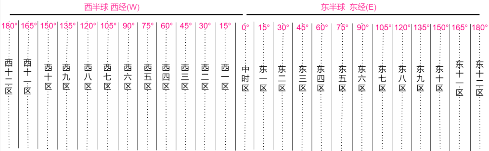
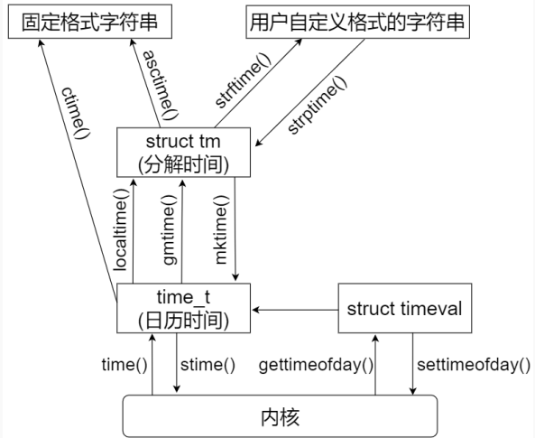
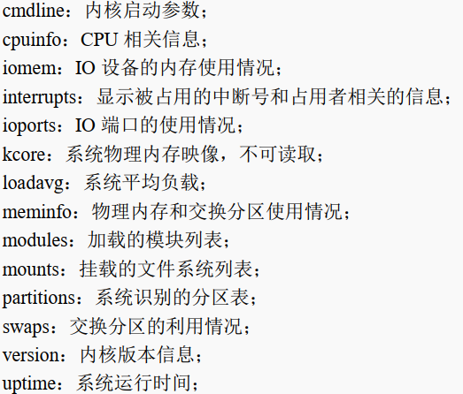

### 1.系统信息

**系统标识uname**

```c
/*uname()用于获取有关当前操作系统内核的名称和信息*/
#include <sys/utsname.h>
int uname(struct utsname *buf);
//buf： struct utsname 结构体类型指针，指向一个 struct utsname 结构体类型对象
//返回值： 成功返回 0；失败将返回-1，并设置 errno

struct utsname {
    char sysname[]; /* 当前操作系统的名称 */
    char nodename[]; /* 网络上的名称（主机名） */
    char release[]; /* 操作系统内核版本 */
    char version[]; /* 操作系统发行版本 */
    char machine[]; /* 硬件架构类型 */
    #ifdef _GNU_SOURCE
    char domainname[];/* 当前域名 */
    #endif
};
```

struct utsname 结构体中的所有成员变量都是字符数组，所以获取到的信息都是字符串  

**sysinfo 函数**

```c
/*sysinfo 系统调用可用于获取一些系统统计信息*/
#include <sys/sysinfo.h>
int sysinfo(struct sysinfo *info);
//info： struct sysinfo 结构体类型指针，指向一个 struct sysinfo 结构体类型对象
//返回值： 成功返回 0；失败将返回-1，并设置 errno

struct sysinfo {
    long uptime; /* 自系统启动之后所经过的时间（以秒为单位） */
    unsigned long loads[3]; /* 1, 5, and 15 minute load averages */
    unsigned long totalram; /* 总的可用内存大小 */
    unsigned long freeram; /* 还未被使用的内存大小 */
    unsigned long sharedram; /* Amount of shared memory */
    unsigned long bufferram; /* Memory used by buffers */
    unsigned long totalswap; /* Total swap space size */
    unsigned long freeswap; /* swap space still available */
    unsigned short procs; /* 系统当前进程数量 */
    unsigned long totalhigh; /* Total high memory size */
    unsigned long freehigh; /* Available high memory size */
    unsigned int mem_unit; /* 内存单元大小（以字节为单位） */
    char _f[20-2*sizeof(long)-sizeof(int)]; /* Padding to 64 bytes */
};
```

**gethostname 函数**

```c
/*此函数可用于单独获取 Linux 系统主机名，与 struct utsname 数据结构体中的 nodename 变量一样*/
#include <unistd.h>
int gethostname(char *name, size_t len);
//name： 指向用于存放主机名字符串的缓冲区
//len： 缓冲区长度
//返回值： 成功返回 0,；失败将返回-1，并会设置 errno
```

**sysconf()函数**

```c
/*sysconf()函数是一个库函数，可在运行时获取系统的一些配置信息*/
#include <unistd.h>
long sysconf(int name);
/*name可取以下宏定义，这里仅列出一部分
_SC_ARG_MAX： exec 族函数的参数的最大长度
_SC_CHILD_MAX： 每个用户的最大并发进程数，也就是同一个用户可以同时运行的最大进程数。
_SC_HOST_NAME_MAX： 主机名的最大长度。
_SC_LOGIN_NAME_MAX： 登录名的最大长度。
_SC_CLK_TCK： 每秒时钟滴答数，也就是系统节拍率。-----常用
_SC_OPEN_MAX： 一个进程可以打开的最大文件数。
_SC_PAGESIZE： 系统页大小（page size）。-----常用
_SC_TTY_NAME_MAX： 终端设备名称的最大长度
*/
//若指定的参数 name 为无效值，则 sysconf()函数返回-1，并会将 errno 设置为 EINVAL。否则返回的值便是对应的配置值
```

### 2.时间日期

**时间的概念**

GMT（Greenwich Mean Time）时间就是英国格林威治当地时间，也就是零时区（中时区）所在时间，与我国的标准时间北京时间（东八区）相差 8 个小时，即早八个小时

UTC（Coordinated Universal Time）指的是世界协调时间（又称世界标准时间、世界统一时间），是经过平均太阳时(以格林威治时间 GMT 为准)、地轴运动修正后的新时标以及以「秒」为单位的国际原子时所综合精算而成的时间  



```shell
date -u #查看到当前的 UTC 时间
date    #查看系统当前的本地时间
```

**Linux系统中的时间**

通常描述时间有两种方式：点时间和段时间；  

操作系统中一般会有两个时钟，一个系统时钟（system clock），一个实时时钟（Real time clock），也叫 RTC；  

Linux 系统在开机启动之后首先会读取 RTC 硬件获取实时时钟作为系统时钟的初始值，之后内核便开始维护自己的系统时钟  

jiffies 是内核中定义的一个全局变量，内核使用 jiffies 来记录系统从启动以来的系统节拍数，所以这个变量用来记录以系统节拍时间为单位的时间长度， Linux 内核在编译配置时定义了一个节拍时间，使用节拍率（一秒钟多少个节拍数）来表示  。一般默认情况下都是采用 100Hz 作为系统节拍率  。

**获取时间**

```c
/*系统调用 time()用于获取当前时间，以秒为单位*/
#include <time.h>
time_t time(time_t *tloc);
//tloc： 如果 tloc 参数不是 NULL，则返回值也存储在 tloc 指向的内存中
//返回值： 成功则返回自 1970-01-01 00:00:00 +0000 (UTC)以来的时间值（以秒为单位）；失败则返回-1，并会设置 errno
```

自 1970-01-01 00:00:00 +0000 (UTC)以来经过的总秒数，我们把这个称之为日历时间或 time_t 时间  

```c
/*gettimeofday()函数提供微秒级时间精度*/
#include <sys/time.h>
int gettimeofday(struct timeval *tv, struct timezone *tz);
//tv： 参数 tv 是一个 struct timeval 结构体指针变量
//tz： 参数 tz 是个历史产物，早期实现用其来获取系统的时区信息，目前已遭废弃，在调用 gettimeofday()函数时应将参数 tz 设置为 NULL
//返回值： 成功返回 0；失败将返回-1，并设置 errno
```

**时间转换函数**



```c
/*ctime()是一个 C 库函数，可以将日历时间转换为可打印输出的字符串形式*/
#include <time.h>
char *ctime(const time_t *timep);
char *ctime_r(const time_t *timep, char *buf);
//timep： time_t 时间变量指针
//返回值： 成功将返回一个 char *类型指针，指向转换后得到的字符串；失败将返回 NULL
```

ctime()是一个不可重入函数，存在一些安全上面的隐患， ctime_r()是 ctime()的可重入版本，一般使用可重入函数 ctime_r()  

```c
/*localtime()函数可以把 time()或 gettimeofday()得到的秒数变成一个 struct tm结构体所表示的时间，该时间对应的是本地时间*/
#include <time.h>
struct tm *localtime(const time_t *timep);
struct tm *localtime_r(const time_t *timep, struct tm *result);
//timep： 需要进行转换的 time_t 时间变量对应的指针，可通过 time()或 gettimeofday()获取得到
//result： 是一个 struct tm 结构体类型指针，参数 result 是可重入函数localtime_r()需要额外提供的参数。
//返回值： 对于不可重入版本 localtime()来说，成功则返回一个有效的 struct tm 结构体指针，而对于可重入版本 localtime_r()来说，成功执行情况下，返回值将会等于参数 result；失败则返回 NULL

struct tm {
    int tm_sec; /* 秒(0-60) */
    int tm_min; /* 分(0-59) */
    int tm_hour; /* 时(0-23) */
    int tm_mday; /* 日(1-31) */
    int tm_mon; /* 月(0-11) */
    int tm_year; /* 年(这个值表示的是自 1900 年到现在经过的年数) */
    int tm_wday; /* 星期(0-6, 星期日 Sunday = 0、星期一=1…) */
    int tm_yday; /* 一年里的第几天(0-365, 1 Jan = 0) */
    int tm_isdst; /* 夏令时 */
};
```

使用可重入版本 localtime_r()调用者需要自己定义 struct tm 结构体变量、并将该变量指针赋值给参数result  

```c
/*与localtime()所不同的是，gmtime()函数所得到的是 UTC 国际标准时间，并不是计算机的本地时间*/
#include <time.h>
struct tm *gmtime(const time_t *timep);
struct tm *gmtime_r(const time_t *timep, struct tm *result);
```

```c
/*mktime()函数与localtime()函数相反，mktime()可以将使用struct tm结构体表示的分解时间转换为time_t时间（日历时间）*/
#include <time.h>
time_t mktime(struct tm *tm);
//tm： 需要进行转换的 struct tm 结构体变量对应的指针
//返回值： 成功返回转换得到 time_t 时间值；失败返回-1
```

```c
/*ctime()是将 time_t 时间转换为固定格式字符串、而 asctime()则是将 struct tm 表示的分解时间
转换为固定格式的字符串*/
#include <time.h>
char *asctime(const struct tm *tm);
char *asctime_r(const struct tm *tm, char *buf);
//tm： 需要进行转换的 struct tm 表示的时间
//buf： 可重入版本函数 asctime_r 需要额外提供的参数 buf，指向一个缓冲区，用于存放转换得到的字符串
//返回值： 转换失败将返回 NULL；成功将返回一个 char *类型指针，指向转换后得到的时间字符串，对于 asctime_r 函数来说，返回值就等于参数 buf
```

```c
/*strftime()可以根据自己的喜好自定义时间的显示格式*/
#include <time.h>
size_t strftime(char *s, size_t max, const char *format, const struct tm *tm);
//s： 指向一个缓存区的指针，该缓冲区用于存放生成的字符串
//max： 字符串的最大字节数
//format： 这是一个用字符串表示的字段，包含了普通字符和特殊格式说明符，可以是这两种字符的任意组合
//tm： 指向 struct tm 结构体对象的指针
//返回值： 如果转换得到的目标字符串不超过最大字节数（也就是 max），则返回放置到 s 数组中的字节数；如果超过了最大字节数，则返回 0
```

strftime 函数特殊格式说明符  

| 说明符 | 表示含义                                                     | 实例        |
| ------ | ------------------------------------------------------------ | ----------- |
| %a     | 星期的缩写                                                   | Sun         |
| %A     | 星期的完整名称                                               | Sunday      |
| %b     | 月份的缩写                                                   | Mar         |
| %B     | 月份的完整名称                                               | March       |
| %c     | 系统当前语言环境对应的首选日期和时间表示形式                 |             |
| %C     | 世纪（年/100）                                               | 20          |
| %d     | 十进制数表示一个月中的第几天（01-31）                        | 15、 05     |
| %D     | 相当于％m/％d/％y                                            | 01/14/21    |
| %e     | 与%d 相同，但是单个数字时，前导 0 会被去掉                   | 15、 5      |
| %F     | 相当于%Y-%m-%d                                               | 2021-01-14  |
| %h     | 相当于%b                                                     | Jan         |
| %H     | 十进制数表示的 24 小时制的小时（范围 00-23）                 | 01、 22     |
| %I     | 十进制数表示的 12 小时制的小时（范围 01-12）                 | 01、 11     |
| %j     | 十进制数表示的一年中的某天（范围 001-366）                   | 050、 285   |
| %k     | 与%H 相同，但是单个数字时，前导 0 会被去掉（范围 0-23）      | 1、 22      |
| %l     | 与%I 相同，但是单个数字时，前导 0 会被去掉（范围 1-12）      | 1、 11      |
| %m     | 十进制数表示的月份（范围 01-12）                             | 01、 10     |
| %M     | 十进制数表示的分钟（范围 00-59）                             | 01、 55     |
| %n     | 换行符                                                       |             |
| %p     | 根据给定的时间值，添加“AM” 或“PM”                            | PM          |
| %P     | 与%p 相同，但会使用小写字母表示                              | pm          |
| %r     | 相当于%I:%M:%S %p                                            | 12:15:31 PM |
| %R     | 相当于%H:%M                                                  | 12:16       |
| %S     | 十进制数表示的秒数（范围 00-60）                             | 05、 30     |
| %T     | 相当于%H:%M:%S                                               | 12:20:03    |
| %u     | 十进制数表示的星期（范围 1-7，星期一为 1）                   | 1、 5       |
| %U     | 十进制数表示，当前年份的第几个星期（范围 00-53），从第一个星期日作为 01 周的第一天开始 |             |
| %W     | 十进制数表示，当前年份的第几个星期（范围 00-53），从第一个星期一作为第 01 周的第一天开始 |             |
| %w     | 十进制数表示的星期，范围为 0-6，星期日为 0                   |             |
| %x     | 系统当前语言环境的首选日期表示形式，没有时间                 | 01/14/21    |
| %X     | 系统当前语言环境的首选时间表示形式，没有日期                 | 12:30:16    |
| %y     | 十进制数表示的年份（后两字数字）                             | 21          |
| %Y     | 十进制数表示的年份（4 个数字）                               | 2021        |
| %%     | 输出%符号                                                    | %           |

**设置时间 settimeofday  **

```c
/*settimeofday()函数可以设置时间，也就是设置系统的本地时间*/
#include <sys/time.h>
int settimeofday(const struct timeval *tv, const struct timezone *tz);
//tv： 参数 tv 是一个 struct timeval 结构体指针变量
//tz： 调用 settimeofday()函数时应将参数 tz 设置为 NULL
//返回值： 成功返回 0；失败将返回-1，并设置 errno
```

使用 settimeofday 设置系统时间时内核会进行权限检查，只有超级用户（root）才可以设置系统时间，普通用户将无操作权限  

### 3.进程时间

用户 CPU 时间：进程在用户空间（用户态）下运行所花费的 CPU 时间。有时也成为虚拟时间（virtual time）。

系统 CPU 时间：进程在内核空间（内核态）下运行所花费的 CPU 时间。

进程时间指的是用户 CPU 时间和系统 CPU 时间的总和，也就是总的 CPU 时间  。

进程时间不等于程序的整个生命周期所消耗的时间，不使用 CPU 资源（例如休眠）的时间不计算在进程时间中 

 **times 函数  **

```c
/*times()函数用于获取当前进程时间*/
#include <sys/times.h>
clock_t times(struct tms *buf);
//buf：times()会将当前进程时间信息存在一个struct tms结构体数据中，所以我们需要提供struct tms变量，使用参数 buf 指向该变量
//返回值： 返回值类型为 clock_t（实质是 long 类型），成功返回从过去任意的一个时间点;失败返回-1，并设置 errno

struct tms {
    clock_t tms_utime; /*进程的用户 CPU 时间, tms_utime 个系统节拍数 */
    clock_t tms_stime; /*进程的系统 CPU 时间, tms_stime 个系统节拍数 */
    clock_t tms_cutime; /*已死掉子进程的 tms_utime + tms_cutime 时间总和 */
    clock_t tms_cstime; /*已死掉子进程的 tms_stime + tms_cstime 时间总和 */
};
```

**clock 函数  **

```c
/*库函数 clock()提供了一个更为简单的方式用于进程时间*/
#include <time.h>
clock_t clock(void);
//想要获得秒数，请除以 CLOCKS_PER_SEC
//返回值： 返回值是到目前为止程序的进程时间,返回的进程时间不可用或其值无法表示，则该返回值是-1
```

### 4.产生随机数  

C 语言函数库中提供了很多函数用于产生伪随机数，其中最常用的是通过 rand()和 srand()产生随机数  

```c
/*rand()函数用于获取随机数，多次调用 rand()可得到一组随机数序列*/
#include <stdlib.h>
int rand(void);
//返回值： 返回一个介于 0 到 RAND_MAX（包含）之间的值
//rand() % n 就可以得到范围 [0 ~ n] 之间的数字
```

通过设置不同的随机数种子，使得每一次启动应用程序所得到的随机数序列是不一样的  

```c
/*srand()函数为 rand()设置随机数种子*/
#include <stdlib.h>
void srand(unsigned int seed);
//seed： 指定一个随机数种子，一般将当前时间作为随机数种子赋值给参数seed,比如time(NULL)
```

### 5.休眠

**秒级休眠 sleep**

```c
#include <unistd.h>
unsigned int sleep(unsigned int seconds);
//seconds： 休眠时长，以秒为单位。
//返回值： 如果休眠时长为参数 seconds 所指定的秒数，则返回 0；若被信号中断则返回剩余的秒数
```

**微秒级休眠 usleep**

```c
#include <unistd.h>
int usleep(useconds_t usec);
//usec： 休眠时长，以微秒为单位
//返回值： 成功返回 0；失败返回-1，并设置 errno
```

**高精度休眠 nanosleep**

```c
/*与 sleep()、 usleep()不同的是， nanosleep()是一个 Linux 系统调用,支持纳秒级时长设置*/
#include <time.h>
int nanosleep(const struct timespec *req, struct timespec *rem);
//req：struct timespec 结构体指针，指向一个 struct timespec 变量，用于设置休眠时间长度，可精确到纳秒级别
//rem：struct timespec 结构体指针，指向一个 struct timespec 变量，也可设置 NULL
//返回值：在成功休眠达到请求的时间间隔后， nanosleep()返回 0；如果中途被信号中断或遇到错误，则返回-1，并将剩余时间记录在参数 rem 指向的 struct timespec 结构体变量中
//rem不为NULL(表示不接收剩余时间)的情况下,还会设置 errno 标识错误类型
```

休眠状态下，该进程会失去 CPU使用权，退出系统调度队列，直到休眠结束  

### 6.申请堆内存

**malloc 和 free  **

Linux C 程序当中一般使用 malloc()函数为程序分配一段堆内存，而使用 free()函数来释放这段内存

```c
#include <stdlib.h>
void *malloc(size_t size);
//size： 需要分配的内存大小，以字节为单位
//返回值：申请成功，将返回一个指向该段内存的指针(需要强转成你希望的类型)，失败或size为0返回NULL

#include <stdlib.h>
void free(void *ptr);
//ptr： 指向需要被释放的堆内存对应的指针
```

Linux 系统中，当一个进程终止时，内核会自动关闭它没有关闭的所有文件，以及所有内存都返还给操作系统  

- 显式调用 free()能使程序具有更好的可读性和可维护性；
- 对于很多程序来说，申请的内存并不是在程序的生命周期中一直需要。

**在堆上分配内存的其它方法  **

```c
/*calloc()函数用来动态地分配内存空间并初始化为 0*/
#include <stdlib.h>
void *calloc(size_t nmemb, size_t size);
//返回值： 分配成功返回指向该内存的地址，失败则返回 NULL

//以下两种写法是等价的
// calloc()分配内存空间并初始化
char *buf1 = (char *)calloc(10, 2);
// malloc()分配内存空间并用 memset()初始化
char *buf2 = (char *)malloc(10 * 2);
memset(buf2, 0, 20);
```

**分配对齐内存**

C 函数库中还提供了一系列在堆上分配对齐内存的函数，对齐内存在某些应用场合非常有必要，常用于分配对其内存的库函数有： posix_memalign()、 aligned_alloc()、 memalign()、 valloc()、 pvalloc()  

```c
/*posix_memalign()函数用于在堆上分配 size 个字节大小的对齐内存空间*/
#include <stdlib.h>
int posix_memalign(void **memptr, size_t alignment, size_t size);
//memptr：内存申请成功后会将分配的内存地址存放在*memptr 中
//alignment： 设置内存对其的字节数， alignment 必须是 2 的幂次方，同时也要是 sizeof(void *)的整数倍。
//size： 设置分配的内存大小，以字节为单位，如果参数 size 等于 0，那么*memptr 中的值是 NULL。
//返回值： 成功将返回 0；失败返回非 0 值
```

```c
/*aligned_alloc()函数用于分配 size 个字节大小的内存空间*/
#include <stdlib.h>
void *aligned_alloc(size_t alignment, size_t size);
//alignment： 用于设置对齐字节大小， alignment 必须是 2 的幂次方
//size： 设置分配的内存大小，以字节为单位。参数 size 必须是参数 alignment 的整数倍。
//返回值： 成功将返回内存空间的指针，内存空间的起始地址是参数 alignment 的整数倍；失败返回 NULL
```

```c
/*memalign()并没有 size 必须是参数 alignment的整数倍这个限制条件*/
//memalign()函数已经过时了，并不提倡使用
#include <malloc.h>
void *memalign(size_t alignment, size_t size);
```

```c
/*valloc()分配 size 个字节大小的内存空间，返回指向该内存空间的指针，内存空间的地址是页大小
（pagesize）的倍数*/
//valloc()函数已经过时了，并不提倡使用
#include <stdlib.h>
void *valloc(size_t size);
```

### 7.proc文件系统

proc 文件系统是一个虚拟文件系统， 它以文件系统的方式为应用层访问系统内核数据提供了接口，与普通文件不同的是， proc 文件系统是动态创建的，文件本身并不存在于磁盘当中、 只存在于内存当中  

proc 文件系统挂载在系统的/proc 目录下，/proc 目录下除了文件夹之外，还有很多的虚拟文件  ，用cat 命令读取或使用read()函数读取  




