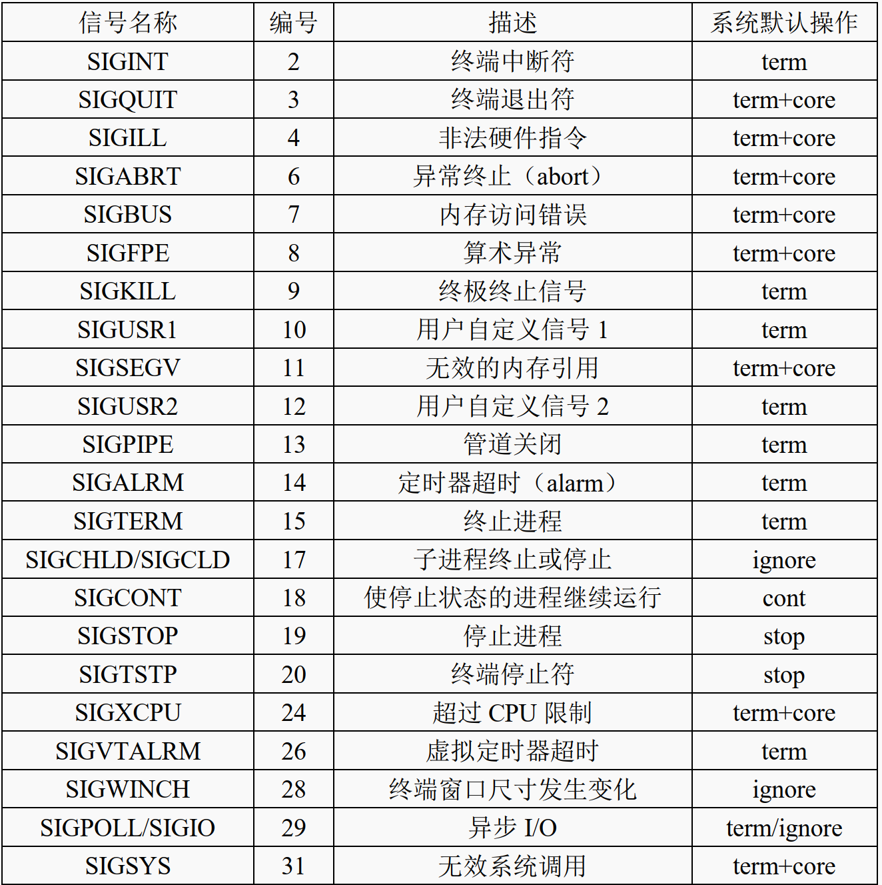

### 1基本概念

信号是事件发生时对进程的通知机制，也可以把它称为软件中断，信号的目的是用来通信，并且是异步的，本质上是int 类型数字编号

信号产生的多种条件：

- 硬件发生异常，即硬件检测到错误条件并通知内核，随即再由内核发送相应的信号给相关进程  
- 用于在终端下输入了能够产生信号的特殊字符  (CTRL + C  中断信号、CTRL + Z 暂停信号)
- 进程调用 kill()系统调用可将任意信号发送给另一个进程或进程组（进程所有者必须相同）
- 用户可以通过 kill 命令将信号发送给其它进程  
- 发生了软件事件，即当检测到某种软件条件已经发生  

信号通常是发送给对应的进程，当信号到达后，该进程需要做出相应的处理措施：忽略信号、捕获信号、执行系统默认的处理方式

### 2信号的分类

分为**可靠信号与不可靠信号**和**实时信号与非实时信号**

在 Linux 系统下使用"kill -l"命令可查看到所有信号  ，数字对应该信号的编号，编号 1~31 所对应的是不可靠信号，编号 34~64 对应的是可靠信号  

非实时信号都不支持排队，都是不可靠信号；实时信号都支持排队，都是可靠信号  

一般也把非实时信号（不可靠信号）称为标准信号  

### 3常见信号与默认行为

term 表示终止进程；core 表示生成核心转储文件；ignore 表示忽略信号； cont 表示继续运行进程； stop 表示停止进程  



### 4进程对信号的处理

**signal()函数  **

```c
#include <signal.h>
typedef void (*sig_t)(int);
sig_t signal(int signum, sig_t handler);
//signum： 此参数指定需要进行设置的信号，可使用信号名（宏）或信号的数字编号，建议使用信号名
//handler： sig_t 类型的函数指针，指向信号对应的信号处理函数,也可以设置为 SIG_IGN(忽略) 或 SIG_DFL(系统默认操作)
//返回值： 返回一个 sig_t 类型的函数指针，成功是指向信号处理函数；如果出错则返回 SIG_ERR，并会设置 errno
```

当一个应用程序刚启动的时候（或者程序中没有调用 signal()函数），通常情况下，进程对所有信号的处理方式都设置为系统默认操作。  

当一个进程调用 fork()创建子进程时，其子进程将会继承父进程的信号处理方式  

**sigaction()函数**

```c
include <signal.h>
int sigaction(int signum, const struct sigaction *act, struct sigaction *oldact);
//signum： 需要设置的信号，除了 SIGKILL 信号和 SIGSTOP 信号之外的任何信号
//act： 指向一个 struct sigaction 数据结构(描述了信号的处理方式)act 为 NULL，则表示无需改变信号当前的处理方式
//oldact：如果oldact 不为 NULL，则会将信号之前的处理方式等信息通过参数 oldact 返回出来

struct sigaction {
    void (*sa_handler)(int);//指定信号处理函数
    void (*sa_sigaction)(int, siginfo_t *, void *);//和sa_handler是互斥的，不能同时设置
    sigset_t sa_mask;//信号掩码可以避免一些信号之间的竞争状态
    int sa_flags;//指定了一组标志，这些标志用于控制信号的处理过程
    void (*sa_restorer)(void);
};
```

一般而言，将信号处理函数设计越简单越好，这就好比中断处理函数，越快越好  

### 5向进程发送信号

**kill()函数**  

```c
#include <sys/types.h>
#include <signal.h>
int kill(pid_t pid, int sig);
//pid：pid 为正数的情况下，用于指定接收此信号的进程 pid；除此之外，参数 pid 也可设置为 0 或-1 以及小于-1 等不同值
//sig：sig 指定需要发送的信号，也可设置为 0(表示不发送信号，但任执行错误检查)
//返回值： 成功返回 0；失败将返回-1，并设置 errno
```

当 sig 为 0 时，仍可进行正常执行的错误检查，但不会发送信号，这通常可用于确定一个特定的进程是否存在，如果向一个不存在的进程发送信号， kill()将会返回-1， errno 将被设置为 ESRCH，表示进程不存在。  

**raise()  **

```c
#include <signal.h>
int raise(int sig);
//sig： 需要发送的信号
//返回值： 成功返回 0；失败将返回非零值

//等价于kill(getpid(), sig);
//getpid()函数用于获取进程自身的 pid
```

### 6alarm()和 pause()函数

**alarm()函数  **

```c
/*设置一个定时器（闹钟），时间到了，内核会向进程发送 SIGALRM信号*/
#include <unistd.h>
unsigned int alarm(unsigned int seconds);
//seconds： 设置定时时间，以秒为单位；如果参数 seconds 等于 0，则表示取消之前设置的 alarm 闹钟
//返回值： 如果在调用 alarm()时， 之前已经为该进程设置了 alarm 闹钟还没有超时，就返回上次闹钟的剩余值且之前设置的闹钟则被新的替代；否则返回 0
```

每个进程只能设置一个 alarm 闹钟，alarm 闹钟并不能循环触发，只能触发一次  

**pause()函数  **

```c
/*pause()系统调用可以使得进程暂停运行、进入休眠状态，直到进程捕获到一个信号为止*/
#include <unistd.h>
int pause(void);
```

### 7信号集

**初始化信号集**  

```c
/*sigemptyset()初始化信号集，使其不包含任何信号；而sigfillset()函数初始化信号集，使其包含所有信号（包括所有实时信号）*/
#include <signal.h>
int sigemptyset(sigset_t *set);
int sigfillset(sigset_t *set);
//set： 指向需要进行初始化的信号集变量
//返回值： 成功返回 0；失败将返回-1，并设置 errno
```

**向信号集中添加/删除信号  **

```c
#include <signal.h>
int sigaddset(sigset_t *set, int signum);
int sigdelset(sigset_t *set, int signum);
//set： 指向信号集
//signum： 需要添加/删除的信号
//返回值： 成功返回 0；失败将返回-1，并设置 errno
```

**测试信号是否在信号集中  **

```c
#include <signal.h>
int sigismember(const sigset_t *set, int signum);
//set： 指定信号集
//signum： 需要进行测试的信号
//返回值： 如果信号 signum 在信号集 set 中，则返回 1；如果不在信号集 set 中，则返回 0；失败则返回-1，并设置 errno
```

### 8获取信号的描述信息

sys_siglist 数组是一个 char *类型的数组，数组中的每一个元素存放的是一个字符串指针，指向一个信号描述信息  

```c
/*strsignal()函数获取到参数 sig 指定的信号对应的描述信息，返回该描述信息字符串的指针*/
#include <string.h>
char *strsignal(int sig);

/*psignal()可以在标准错误（stderr）上输出信号描述信息*/
#include <signal.h>
void psignal(int sig, const char *s);
```

### 9信号掩码(阻塞信号传递)

内核为每一个进程维护了一个信号掩码（其实就是一个信号集），即一组信号。当进程接收到一个属于信号掩码中定义的信号时，该信号将会被阻塞、无法传递给进程进行处理，那么内核会将其阻塞，直到该信号从信号掩码中移除，内核才会把该信号传递给进程从而得到处理。

向信号掩码中添加一个信号  

- 应用程序调用 signal()或 sigaction()函数为某一个信号设置处理方式时，进程会自动将该信号添加到信号掩码中；sigaction()函数需要看是否设置了 SA_NODEFER 标志；当信号处理函数结束返回后，会自动将该信号从信号掩码中移除  
- 使用 sigaction()函数为信号设置处理方式时，可以通过sa_mask 参数进行设置
-   使用 sigprocmask()系统调用，随时可以显式地向信号掩码中添加、移除信号

```c
#include <signal.h>
int sigprocmask(int how, const sigset_t *set, sigset_t *oldset);
//how： 参数 how 指定了调用函数时的一些行为
//set： 将参数 set 指向的信号集内的所有信号添加到信号掩码中或者从信号掩码中移除；如果参数 set 为NULL，则表示无需对当前信号掩码作出改动
//oldset：获取到进程当前的信号掩码，存放在 oldset 所指定的信号集中；如果为 NULL 则表示不获取当前的信号掩码
//返回值： 成功返回 0；失败将返回-1，并设置 errno

//how可以设置成以下宏
//SIG_BLOCK：将参数 set 所指向的信号集内的所有信号添加到进程的信号掩码中
//SIG_UNBLOCK：将参数 set 指向的信号集内的所有信号从进程信号掩码中移除
//SIG_SETMASK：进程信号掩码直接设置为参数 set 指向的信号集
```

### 10 阻塞等待信号 sigsuspend()

```c
#include <signal.h>
int sigsuspend(const sigset_t *mask);
//mask： 参数 mask 指向一个信号集
//返回值： sigsuspend()始终返回-1，并设置 errno 来指示错误（通常为 EINTR），表示被信号所中断，如果调用失败，将 errno 设置为 EFAULT

//调用 sigsuspend()函数相当于以不可中断（原子操作）的方式执行以下操作
sigprocmask(SIG_SETMASK, &mask, &old_mask);
pause();
sigprocmask(SIG_SETMASK, &old_mask, NULL);
```

sigsuspend()函数会将参数 mask 所指向的信号集来替换进程的信号掩码，也就是将进程的信号掩码设置为参数 mask 所指向的信号集，然后挂起进程，直到捕获到信号被唤醒（如果捕获的信号是 mask 信号集中的成员，将不会唤醒、继续挂起）、并从信号处理函数返回，一旦从信号处理函数返回， sigsuspend()会将进程的信号掩码恢复成调用前的值。  

### 11 实时信号

**sigpending()函数**  

```c
/*为了确定进程中处于等待状态的是哪些信号，可以使用 sigpending()函数获取*/
#include <signal.h>
int sigpending(sigset_t *set);
//set： 处于等待状态的信号会存放在参数 set 所指向的信号集中
//返回值： 成功返回 0；失败将返回-1，并设置 errno
```

**发送实时信号  **

等待信号集只是一个掩码，仅表明一个信号是否发生，而不能表示其发生的次数。  

发送进程使用 sigqueue()系统调用向另一个进程发送实时信号以及伴随数据。

```c
#include <signal.h>
int sigqueue(pid_t pid, int sig, const union sigval value);
//pid： 指定接收信号的进程对应的 pid，将信号发送给该进程
//sig： 指定需要发送的信号。与 kill()函数一样，也可将参数 sig 设置为 0，用于检查参数 pid 所指定的进程是否存在
//value： 参数 value 指定了信号的伴随数据， union sigval 数据类型
//返回值： 成功将返回 0；失败将返回-1，并设置 errno

typedef union sigval
{
    int sival_int;
    void *sival_ptr;
} sigval_t;
```

### 12 异常退出 abort()函数

对于异常退出程序，则一般使用 abort()库函数，使用 abort()终止进程运行，会生成核心转储文件，可用于判断程序调用 abort()时的程序状态  

```c
#include <stdlib.h>
void abort(void);
```

函数 abort()通常产生 SIGABRT 信号来终止调用该函数的进程， SIGABRT 信号的系统默认操作是终止进程运行、并生成核心转储文件；当调用 abort()函数之后，内核会向进程发送 SIGABRT 信号。  