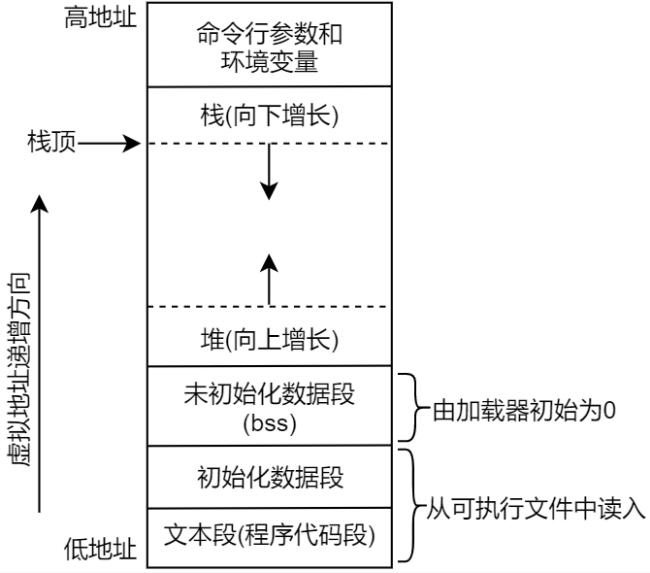
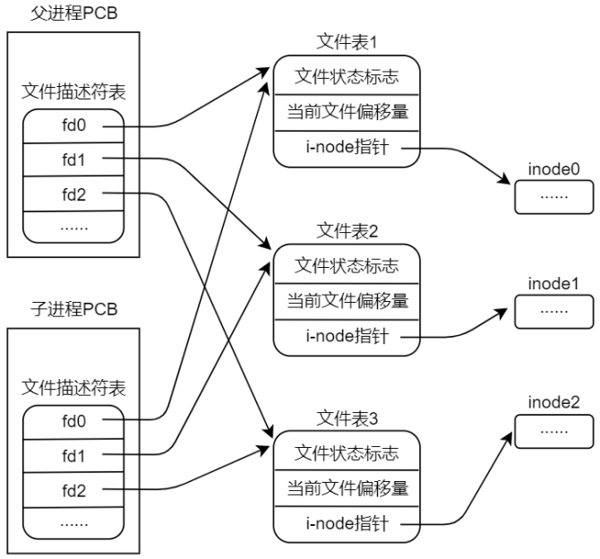
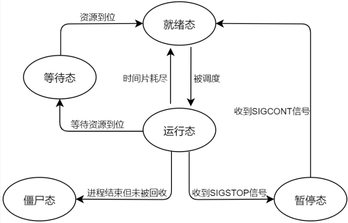
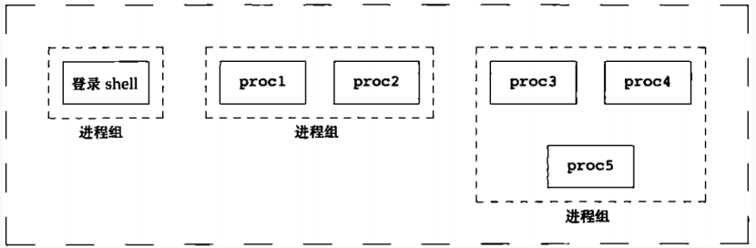

### 1 进程与程序

1. main函数由谁调用：

在编译链接时，由链接器将引导代码链接到应用程序当中，一起构成最终的可执行文件。  

程序运行需要通过操作系统的加载器来实现，加载器是操作系统中的程序，当执行程序时，加载器负责将此应用程序加载内存中去执行。  

2. 程序结束其实就是进程终止，进程终止的方式通常有多种，大体上分为正常终止和异常终止  

正常终止包括：

- main()函数中通过 return 语句返回来终止进程；
- 应用程序中调用 exit()函数终止进程；
- 应用程序中调用\_exit()或\_Exit()终止进程；

异常终止包括：

- 应用程序中调用 abort()函数终止进程；
- 进程接收到一个信号，譬如 SIGKILL 信号

```c
/*atexit()库函数用于注册一个进程在正常终止时要调用的函数*/
#include <stdlib.h>
int atexit(void (*function)(void));
//function： 函数指针，指向注册的函数，此函数无需传入参数、无返回值
//返回值： 成功返回 0；失败返回非 0
```

3. 进程其实就是一个可执行程序的实例，进程是一个动态过程，而非静态文件，它是程序的一次运行过程，当应用程序被加载到内存中运行之后它就称为了一个进程，当程序运行结束后也就意味着进程终止，这就是进程的一个生命周期。  

4. Linux 系统下的每一个进程都有一个进程号（process ID，简称 PID），进程号是一个正数，用于唯一标识系统中的某一个进程。  

```c
/*系统调用 getpid()来获取本进程的进程号*/
#include <sys/types.h>
#include <unistd.h>
pid_t getpid(void);
```

```c
/*getppid()系统调用获取父进程的进程号*/
#include <sys/types.h>
#include <unistd.h>
pid_t getppid(void);
```

### 2 进程的环境变量

每一个进程都有一组与其相关的环境变量，这些环境变量以字符串形式存储在一个字符串数组列表中，把这个数组称为环境列表。  

1. 新的进程在创建之前，会继承其父进程的环境变量副本，环境变量存放在一个字符串数组中，在应用程序中，通过 environ 变量指向它， environ 是一个全局变量  

```c
extern char **environ; // 申明外部全局变量 environ
```

```c
/*库函数 getenv()获取某个指定的环境变量*/
#include <stdlib.h>
char *getenv(const char *name);
//name： 指定获取的环境变量名称
//返回值： 如果存放该环境变量，则返回该环境变量的值对应字符串的指针；如果不存在该环境变量，则返回 NULL
```

2. C 语言函数库中提供了用于修改、添加、删除环境变量的函数，譬如 putenv()、 setenv()、 unsetenv()、clearenv()函数等  

**putenv()函数  **

```c
/*putenv()函数可向进程的环境变量数组中添加一个新的环境变量，或者修改一个已经存在的环境变量对应的值*/
#include <stdlib.h>
int putenv(char *string);
//string： 参数 string 是一个字符串指针，指向 name=value 形式的字符串
//返回值： 成功返回 0；失败将返回非 0 值，并设置 errno
```

**setenv()函数  **

```c
/*setenv()函数可以替代 putenv()函数*/
#include <stdlib.h>
int setenv(const char *name, const char *value, int overwrite);
//name： 需要添加或修改的环境变量名称
//value： 环境变量的值
//overwrite： 若参数 name 标识的环境变量已经存在，在参数 overwrite 为 0 的情况下， setenv()函数将不改变现有环境变量的值，也就是说本次调用没有产生任何影响；如果参数 overwrite 的值为非 0，若参数 name标识的环境变量已经存在，则覆盖，不存在则表示添加新的环境变量。
//返回值： 成功返回 0；失败将返回-1，并设置 errno
```

```c
//在执行程序的时候，在其路径前面添加环境变量，以 name=value 的形式添加
//如果是多个环境变量，则在./app 前面放置多对 name=value 即可，以空格分隔
NAME=value ./app
```

**unsetenv()函数  **

```c
/*unsetenv()函数可以从环境变量表中移除参数 name 标识的环境变量*/
#include <stdlib.h>
int unsetenv(const char *name);
```

3. 清空环境变量  

```c
//通过将全局变量 environ 赋值为 NULL来清空所有变量
environ = NULL;

#include <stdlib.h>
int clearenv(void);
//clearenv()函数内部的做法其实就是将environ赋值为NULL
```

### 3 进程的内存布局

**正文段。**也可称为代码段，这是 CPU 执行的机器语言指令部分，文本段具有只读属性，以防止程序由于意外而修改其指令；正文段是可以共享的，即使在多个进程间也可同时运行同一段程序。

**初始化数据段。**通常将此段称为数据段，包含了显式初始化的全局变量和静态变量，当程序加载到内存中时，从可执行文件中读取这些变量的值。

**未初始化数据段。**包含了未进行显式初始化的全局变量和静态变量，通常将此段称为 bss 段，这一名词来源于早期汇编程序中的一个操作符，意思是“由符号开始的块”（block started by symbol）

**栈。**函数内的局部变量以及每次函数调用时所需保存的信息都放在此段中，每次调用函数时，函数传递的实参以及函数返回值等也都存放在栈中。

**堆。**可在运行时动态进行内存分配的一块区域，譬如使用 malloc()分配的内存空间，就是从系统堆内存中申请分配的。



### 4 进程的虚拟地址空间

1. 虚拟地址会通过硬件 MMU（内存管理单元）映射到实际的物理地址空间中，建立虚拟地址到物理地址的映射关系后，对虚拟地址的读写操作实际上就是对物理地址的读写操作， MMU 会将物理地址“翻译”为对应的物理地址，其关系如下所示  


2. 为什么需要引入虚拟地址  

- 进程与进程、进程与内核相互隔离。  
- 在某些应用场合下，两个或者更多进程能够共享内存。  
- 便于实现内存保护机制。  
- 编译应用程序时，无需关心链接地址。  

### 5 fork()创建子进程

一个现有的进程可以调用 fork()函数创建一个新的进程，调用 fork()函数的进程称为父进程，由 fork()函数创建出来的进程被称为子进程（child process）  

```c
#include <unistd.h>
pid_t fork(void);
```

- fork()调用成功后，将会在父进程中返回子进程的 PID，而在子进程中返回值是 0；如果调用失败，父进程返回值-1，不创建子进程，并设置 errno  

- 子进程拷贝了父进程的数据段、堆、栈以及继承了父进程打开的文件描述符  这是子进程对父进程相应部分存储空间的完全复制  

- 每个进程均可修改各自的栈数据以及堆段中的变量，而并不影响另一个进程。对于程序代码段（文本段）来说，两个进程执行相同的代码段，因为代码段是只读的，也就是说父子进程共享代码段，在内存中只存在一份代码段数据
- fork()函数调用完成之后，父进程、子进程会各自继续执行 fork()之后的指令，它们共享代码段，但并不共享数据段、堆、栈等  

### 6 父、子进程间的文件共享



* 子进程拷贝了父进程的文件描述符表，使得父、子进程中对应的文件描述符指向了相同的文件表，也意味着父、子进程中对应的文件描述符指向了磁盘中相同的文件  

* 在fork（）之后在打开同样的文件，父、子进程不会共享同样的文件偏移量，而是有各自的文件偏移量

**fork()函数使用场景  **

- 父进程希望子进程复制自己，使父进程和子进程同时执行不同的代码段。 
- 一个进程要执行不同的程序。   

### 7 系统调用 vfork()

```c
#include <sys/types.h>
#include <unistd.h>
pid_t vfork(void);
```

- 在fork（）在第二种场景使用时，去到新程序 main 函数开始执行、并为新程序重新初始化其数据段、堆段、栈段等，并不需要用到父进程的，所以使用vfork（）就会更加有效率
- vfork()可以为调用该函数的进程创建一个新的子进程，然而， vfork()是为子进程立即执行exec()新的程序而专门设计的  
- 虽然 vfork()系统调用在效率上要优于 fork()，但是 vfork()可能会导致一些难以察觉的程序 bug，除非速度绝对重要的场合，我们的程序当中应舍弃 vfork()而使用 fork()  


### 8 fork()之后的竞争条件  

虽然绝大部分情况下，父进程会先于子进程被执行，但是并不排除子进程先于父进程被执行的可能性，当程序产生正确的结果它依赖于特定的执行顺序，那么将可能因竞争条件而导致失败、无法得到正确的结果  

### 9 进程的诞生与终止

1. 进程号为 1 的进程便是所有进程的父进程，通常称为 init 进程，它是 Linux 系统启动之后运行的第一个进程，它管理着系统上所有其它进程， init 进程是由内核启动，因此理论上说它没有父进程。  

2. 在我们的程序当中，一般使用 exit()库函数而非\_exit()系统调用，原因在于 exit()最终也会通过\_exit()终止进程，exit()函数会执行的动作如下:

   - 如果程序中注册了进程终止处理函数，那么会调用终止处理函数。

   - 刷新 stdio 流缓冲区。

   - 执行_exit()系统调用。

3. 一般推荐的是子进程使用\_exit()退出、而父进程则使用 exit()退出。其原因就在于调用 exit()函数终止进程时会刷新进程的 stdio 缓冲区。  
   采用以下任一方法来避免重复的输出结果：
   * 对于行缓冲设备，可以加上对应换行符，譬如 printf 打印输出字符串时在字符串后面添加\n 换行符，对于puts()函数来说，本身会自动添加换行符
   * 在调用 fork()之前，使用函数 fflush()来刷新 stdio 缓冲区，当然，作为另一种选择，也可以使用setvbuf()和 setbuf()来关闭 stdio 流的缓冲功能
   * 子进程调用\_exit()退出进程、而非使用 exit()，调用\_exit()在退出时便不会刷新 stdio 缓冲区  

### 10 监视子进程

**wait()函数  **

```c
#include <sys/types.h>
#include <sys/wait.h>
pid_t wait(int *status);
//status： 参数 status 用于存放子进程终止时的状态信息，参数 status 可以为 NULL，表示不接收子进程终止时的状态信息
//返回值： 若成功则返回终止的子进程对应的进程号；失败则返回-1
```

- 调用 wait()函数，如果其所有子进程都还在运行，则 wait()会一直阻塞等待，直到某一个子进程终止。
- 如果进程调用 wait()，但是该进程并没有子进程，也就意味着该进程并没有需要等待的子进程，那么 wait()将返回错误。
- 如果进程调用 wait()之前，它的子进程当中已经有一个或多个子进程已经终止了，那么调用wait()也不会阻塞。

**waitpid()函数  **

```c
#include <sys/types.h>
#include <sys/wait.h>
pid_t waitpid(pid_t pid, int *status, int options);
//pid： 参数 pid 用于表示需要等待的某个具体子进程，关于参数 pid 的取值范围如下：
    //如果 pid 大于 0，表示等待进程号为 pid 的子进程；
    //如果 pid 等于 0，则等待与调用进程（父进程）同一个进程组的所有子进程；
    //如果 pid 小于-1，则会等待进程组标识符与 pid 绝对值相等的所有子进程；
    //如果 pid 等于-1，则等待任意子进程。 wait(&status)与 waitpid(-1, &status, 0)等价。
//status： 与 wait()函数的 status 参数意义相同。
//options： 是一个位掩码，可以包括 0 个或多个如下标志
    //WNOHANG： 如果子进程没有发生状态改变（终止、暂停），则立即返回
    //WUNTRACED： 除了返回终止的子进程的状态信息外，还返回因信号而停止（暂停运行）的子进程状态信息
    //WCONTINUED： 返回那些因收到 SIGCONT 信号而恢复运行的子进程的状态信息
//返回值： 返回值与 wait()函数的返回值意义基本相同，在参数 options 包含了 WNOHANG 标志的情况下，返回值会出现 0
```

**僵尸进程与孤儿进程  **

孤儿进程是指父进程在子进程之前终止，导致子进程失去父进程控制的进程状态，在 Linux 系统当中，所有的孤儿进程都自动成为 init 进程（进程号为 1）的子进程。

僵尸进程是指子进程已经终止，但其父进程尚未调用`wait()`或`waitpid()`获取子进程终止状态信息，导致子进程的进程描述符(PCB)仍保留在系统进程表中的进程状态

**SIGCHLD 信号  **

- 当父进程的某个子进程终止时，父进程会收到 SIGCHLD 信号；
- 当父进程的某个子进程因收到信号而停止（暂停运行）或恢复时，内核也可能向父进程发送该信号
- 在 SIGCHLD 信号处理函数中循环以非阻塞方式来调用 waitpid()，直至再无其它终止的子进程需要处理为止  

### 11 执行新程序  

当子进程的工作不再是运行父进程的代码段，而是运行另一个新程序的代码，那么这个时候子进程可以通过 exec 函数来实现运行另一个新的程序。

**execve()函数  **

```c
/* execve()函数将一个外部的可执行文件加载到进程的内存空间运行，使用新的程序替换旧的程序，而进程的栈、数据、以及堆数据会被新程序的相应部件所替换*/
#include <unistd.h>
int execve(const char *filename, char *const argv[], char *const envp[]);
//filename： 参数 filename 指向需要载入当前进程空间的新程序的路径名，既可以是绝对路径、也可以是相对路径
//argv： 参数 argv 则指定了传递给新程序的命令行参数，argv[0]对应的便是新程序自身路径名
//envp： 参数 envp 也是一个字符串指针数组，指定了新程序的环境变量列表，同样也是以 NULL 结束，所指向的字符串格式为 name=value
//返回值： execve 调用成功将不会返回；失败将返回-1，并设置 errno
```

**exec 库函数  **

```c
#include <unistd.h>
extern char **environ;
int execl(const char *path, const char *arg, ... /* (char *) NULL */);
int execv(const char *path, char *const argv[]);
//execl()和 execv()都是基本的 exec 函数，要求提供新程序的路径名

int execlp(const char *file, const char *arg, ... /* (char *) NULL */);
int execvp(const char *file, char *const argv[]);
//execlp()和 execvp()只要求提供新程序文件名

int execle(const char *path, const char *arg, ... /*, (char *) NULL, char * const envp[] */);
int execvpe(const char *file, char *const argv[], char *const envp[]);
//这两个函数可以指定自定义的环境变量列表给新程序
```

**system()函数  **

```c
/*system()函数可以很方便地在我们的程序当中执行任意 shell 命令*/
#include <stdlib.h>
int system(const char *command);
//command： 参数 command 指向需要执行的 shell 命令，以字符串的形式提供，譬如"ls -al"、 "echo HelloWorld"等。
//返回值： 
//当参数 command 为 NULL，如果 shell 可用则返回一个非 0 值，若不可用则返回 0
//无法创建子进程或无法获取子进程的终止状态，那么 system()返回-1
//如果子进程不能执行 shell，则 system()的返回值就好像是子进程通过调用_exit(127)终止了
//如果所有的系统调用都成功， system()函数会返回执行 command 的 shell 进程的终止状态
```

system()的主要优点在于使用上方便简单，编程时无需自己处理对 fork()、 exec 函数、 waitpid()以及 exit()等调用细节， system()内部会代为处理  

### 12 进程状态与进程关系

**进程状态**

- 就绪态（Ready）：指该进程满足被 CPU 调度的所有条件但此时并没有被调度执行，只要得到 CPU就能够直接运行；意味着该进程已经准备好被 CPU 执行，当一个进程的时间片到达，操作系统调度程序会从就绪态链表中调度一个进程；
- 运行态：指该进程当前正在被 CPU 调度运行，处于就绪态的进程得到 CPU 调度就会进入运行态；
- 僵尸态：僵尸态进程其实指的就是僵尸进程；
- 可中断睡眠状态：可中断睡眠也称为浅度睡眠，可以被唤醒，一般来说可以通过信号来唤醒；
- 不可中断睡眠状态：不可中断睡眠称为深度睡眠，深度睡眠无法被信号唤醒，只能等待相应的条件成立才能结束睡眠状态。把浅度睡眠和深度睡眠统称为等待态（或者叫阻塞态），表示进程处于一种等待状态，等待某种条件成立之后便会进入到就绪态；所以，处于等待态的进程是无法参与进程系统调度的。
- 暂停态：暂停并不是进程的终止，表示进程暂停运行，一般可通过信号将进程暂停，譬如SIGSTOP信号；处于暂停态的进程是可以恢复进入到就绪态的，譬如收到 SIGCONT 信号



**进程关系  **

1. 无关系
   两个进程间没有任何关系，相互独立。

2. 父子进程关系

   两个进程间构成父子进程关系，譬如一个进程 fork()创建出了另一个进程，那么这两个进程间就构成了父子进程关系，调用 fork()的进程称为父进程、而被 fork()创建出来的进程称为子进程；当然，如果“生父”先与子进程结束，那么 init 进程（“养父”）就会成为子进程的父进程，它们之间同样也是父子进程关系。

3. 进程组

   每个进程除了有一个进程 ID、父进程 ID 之外，还有一个进程组 ID，用于标识该进程属于哪一个进程组，进程组是一个或多个进程的集合，这些进程并不是孤立的，它们彼此之间或者存在父子、兄弟关系，或者在功能上有联系。

```c
/*系统调用 getpgrp()或 getpgid()可以获取进程对应的进程组 ID*/
#include <unistd.h>
pid_t getpgid(pid_t pid);
pid_t getpgrp(void);
//getpgrp()就等价于 getpgid(0)
```

```c
/*系统调用 setpgid()或 setpgrp()可以加入一个现有的进程组或创建一个新的进程组*/
#include <unistd.h>
int setpgid(pid_t pid, pid_t pgid);
int setpgrp(void);
//setpgrp()函数等价于 setpgid(0, 0)
```

一个进程只能为它自己或它的子进程设置进程组 ID，在它的子进程调用 exec 函数后，它就不能更改该子进程的进程组 ID 了  

4. 会话  

   

   * 一个会话可包含一个或多个进程组，但只能有一个前台进程组，其它的是后台进程组；
   * 每个会话都有一个会话首领（leader），即创建会话的进程。
   * 一个会话可以有控制终端、也可没有控制终端 
   * 会话的首领进程连接一个终端之后，该终端就成为会话的控制终端，与控制终端建立连接的会话首领进程被称为控制进程；
   * 产生在终端上的输入和信号将发送给会话的前台进程组中的所有进程  

```c
/*系统调用 getsid()可以获取进程的会话 ID*/
#include <unistd.h>
pid_t getsid(pid_t pid);
//参数 pid 为 0，则返回调用者进程的会话 ID；
//如果参数 pid不为 0，则返回参数 pid 指定的进程对应的会话 ID
```

```c
/*系统调用 setsid()可以创建一个会话*/
#include <unistd.h>
pid_t setsid(void);
```

如果调用者进程不是进程组的组长进程，调用 setsid()将创建一个新的会话，调用者进程是新会话的首领进程，同样也是一个新的进程组的组长进程，调用 setsid()创建的会话将没有控制终端  

### 13 守护进程

守护进程（Daemon）也称为精灵进程，是运行在后台的一种特殊进程，它独立于控制终端并且周期性地执行某种任务或等待处理某些事情的发生，主要表现为以下两个特点:

* 长期运行。 守护进程是一种生存期很长的一种进程，它们一般在系统启动时开始运行，除非强行终止，否则直到系统关机都会==保持运行==。 
* 与控制终端脱离。 在 Linux 中，系统与用户交互的界面称为终端，每一个从终端开始运行的进程都会依附于这个终端，也就是会话的控制终端。

守护进程与终端无任何关联，用户的登录与注销与守护进程无关、不受其影响，守护进程自成进程组、自成会话，即pid=gid=sid。  

**编写守护进程程序**  

1. 创建子进程、终止父进程
   * 如果该守护进程是作为一条简单地 shell 命令启动，那么父进程终止会让 shell 认为这条命令已经执行完毕。
   * 虽然子进程继承了父进程的进程组ID，但它有自己独立的进程ID，这保证了子进程不是一个进程组的组长进程，这是下面将要调用 setsid 函数的先决条件    
2. 子进程调用 setsid 创建会话
   * 让子进程摆脱原会话的控制
   * 让子进程摆脱原进程组的控制
   * 让子进程摆脱原控制终端的控制   
3. 将工作目录更改为根目录
   * 子进程是继承了父进程的当前工作目录，由于在进程运行中，当前目录所在的文件系统是不能卸载的，这对以后使用会造成很多的麻烦。
   * 通常的做法是让“/”作为守护进程的当前目录。
4. 重设文件权限掩码 umask
   * 使用 fork 函数新建的子进程继承了父进程的文件权限掩码，这就给子进程使用文件带来了诸多的麻烦。
   * 把文件权限掩码设置为 0，确保子进程有最大操作权限、这样可以大大增强该守护进程的灵活性。
5. 关闭不再需要的文件描述符
   * 子进程继承了父进程的所有文件描述符，这些被打开的文件可能永远不会被守护进程读或写。
   * 但它们一样消耗系统资源，可能导致所在的文件系统无法卸载，所以必须关闭这些文件。
6. 将文件描述符号为 0、 1、 2 定位到/dev/null
   * 这使得守护进程的输出无处显示、也无处从交互式用户那里接收输入。  
7. 其它：忽略 SIGCHLD 信号
   * 在 Linux 下，可以将 SIGCHLD 信号的处理方式设置为SIG_IGN，也就是忽略该信号，可让内核将僵尸进程转交给 init 进程去处理，这样既不会产生僵尸进程、又省去了服务器进程回收子进程所占用的时间

**SIGHUP 信号  **

* 当用户准备退出会话时，系统向该会话发出 SIGHUP 信号，会话将 SIGHUP 信号发送给所有子进程，子进程接收到 SIGHUP 信号后，便会自动终止，当所有会话中的所有进程都退出时，会话也就终止了。  
* 因为程序当中一般不会对 SIGHUP 信号进行处理，所以对应的处理方式为系统默认方式， SIGHUP 信号的系统默认处理方式便是终止进程。  

### 14单例模式运行

程序只能被执行一次，只要该程序没有结束，就无法再次运行，我们把这种情况称为单例模式运行 

**用一个文件的存在与否来做标志**

在程序运行正式代码之前，先判断一个特定的文件是否存在，如果存在则表明进程已经运行，此时应该立马退出；如果不存在则表明进程没有运行，然后创建该文件，当程序结束时再删除该文件即可

**使用文件锁来实现**

* 调用 open 时一般使用O_WRONLY | O_CREAT 标志，当文件不存在则创建该文件，然后尝试去获取文件锁，若是成功，则将程序的进程号（PID）写入到该文件中，写入后不要关闭文件或解锁（释放文件锁），保证进程一直持有该文件锁；若是程序获取锁失败，代表程序已经被运行、则退出本次启动。
* 当程序退出或文件关闭之后，文件锁会自动解锁

如果我们要去实现一个以单例模式运行的程序，譬如一个守护进程，那么也应该将这个特定文件放置于 Linux 系统/var/run/目录下，并且文件的命名方式为 name.pid（name 表示进程名）。 


