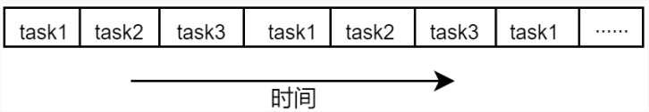

### 1线程概述

**线程概念**

1. 线程是参与系统调度的最小单位。它被包含在进程之中，是进程中的实际运行单位。

2. 当一个程序启动时，就有一个进程被操作系统（OS）创建，与此同时一个线程也立刻运行，该线程通常叫做程序的主线程（Main Thread）  

3. 只有主线程的进程称为单线程进程  

4. 主线程的重要性体现在两方面：

   * 其它新的线程（也就是子线程）是由主线程创建的；
   * 主线程通常会在最后结束运行，执行各种清理工作，譬如回收各个子线程。

5. 线程是程序最基本的运行单位，而进程不能运行，真正运行的是进程中的线程。  

6. 同一进程中的多个线程将共享该进程中的全部系统资源，如虚拟地址空间，文件描述符和信号处理等等。但同一进程中的多个线程有各自的调用栈（call stack，我们称为线程栈），自己的寄存器环境（register context）、自己的线程本地存储（thread-local storage）。  

7. 多进程编程劣势：

   * 进程间切换开销大。进程间切换开销远大于同一进程的多个线程间切换的开销，通常对于一些中小型应用程序来说不划算。
   * 进程间通信较为麻烦。每个进程都在各自的地址空间中、相互独立、隔离，处在于不同的地址空间中，因此相互通信较为麻烦。

   多线程弥补：

   * 同一进程的多个线程间切换开销比较小。  
   * 同一进程的多个线程间通信容易。 
   * 线程创建的速度远大于进程创建的速度。  
   * 线程在多核处理器上更有优势。

**并发和并行**

串行是一种顺序执行，依次按照顺序完成每一件事情，必须要完成上一件事才能去做下一件事，只有一个执行单元。    


并行指的是可以并排/并列执行多个任务，这样的系统，它通常有多个执行单元。并行运行并不一定要同时开始运行、同时结束运行，只需满足在某一个时间段上存在多个任务被多个执行单元同时在运行着。


相比于串行和并行，并发强调的是一种时分复用，与串行的区别在于，它不必等待上一个任务完成之后在做下一个任务，可以打断当前执行的任务切换执行下一个任何，这就是时分复用。



串行：一件事、一件事接着做；

并发：交替做不同的事；

并行：同时做不同的事。

### 2线程ID

进程 ID 在整个系统中是唯一的，但线程 ID 不同，线程 ID 只有在它所属的进程上下文中才有意义。  

```c
/*pthread_self()来获取自己的线程 ID*/
#include <pthread.h>
pthread_t pthread_self(void);
//该函数调用总是成功，返回当前线程的线程 ID

/*pthread_equal()函数来检查两个线程 ID 是否相等*/
#include <pthread.h>
int pthread_equal(pthread_t t1, pthread_t t2);
```

线程相关函数通过线程 ID 来标识要操作的目标线程。

### 3创建线程

```c
/* pthread_create()负责创建一个新的线程，创建出来的新线程被称为主线程的子线程*/
#include <pthread.h>
int pthread_create(pthread_t *thread, 
                   const pthread_attr_t *attr, 
                   void *(*start_routine) (void *), 
                   void *arg);
//thread： pthread_t 类型指针，当 pthread_create()成功返回时，新创建的线程的线程 ID 会保存在参数 thread所指向的内存中，后续的线程相关函数会使用该标识来引用此线程
//attr： pthread_attr_t 类型指针，指向 pthread_attr_t 类型的缓冲区， pthread_attr_t 数据类型定义了线程的各种属性， attr 设置为 NULL，线程的所有属性设置为默认值
//start_routine： 参数 start_routine 是一个函数指针，新创建的线程从 start_routine()函数开始运行，该函数返回值类型为void *，并且该函数的参数只有一个void *，其实这个参数就是pthread_create()函数的第四个参数 arg。如果需要向 start_routine()传递的参数有一个以上，那么需要把这些参数放到一个结构体中，然后把这个结构体对象的地址作为 arg 参数传入
//arg： 传递给 start_routine()函数的参数。一般情况下，需要将 arg 指向一个全局或堆变量，意思就是说在线程的生命周期中，该 arg 指向的对象必须存在，否则如果线程中访问了该对象将会出现错误。当然也可将参数 arg 设置为 NULL，表示不需要传入参数给 start_routine()函数
//返回值： 成功返回 0；失败时将返回一个错误号，并且参数 thread 指向的内容是不确定的
```

使用-l 选项指定链接库 pthread，原因在于 pthread 不在 gcc 的默认链接库中，所以需要手动指定。  

### 4终止线程

```c
/*pthread_exit()函数将终止调用它的线程*/
#include <pthread.h>
void pthread_exit(void *retval);
//retval：可以自己自定义退出码
```

调用 pthread_exit()相当于在线程的 start 函数中执行 return 语句，不同之处在于，可在线程 start 函数所调用的任意函数中调用 pthread_exit()来终止线程。

### 5回收线程

在线程当中需要通过调用 pthread_join()函数来阻塞等待线程的终止，并获取线程的退出码，回收线程资源。

```c
#include <pthread.h>
int pthread_join(pthread_t thread, void **retval);
//thread： pthread_join()等待指定线程的终止，通过参数 thread（线程 ID）指定需要等待的线程
//retval： 如果参数 retval 不为 NULL，则 pthread_join()将目标线程的退出状态（即目标线程通过pthread_exit()退出时指定的返回值或者在线程 start 函数中执行 return 语句对应的返回值）复制到*retval 所指向的内存区域；如果目标线程被 pthread_cancel()取消，则将 PTHREAD_CANCELED（-1） 放在*retval 中。如果对目标线程的终止状态不感兴趣，则可将参数 retval 设置为 NULL
//返回值： 成功返回 0；失败将返回错误码
```

调用 pthread_join()函数将会以阻塞的形式等待指定的线程终止，如果该线程已经终止，则 pthread_join()立刻返回。如果多个线程同时尝试调用 pthread_join()等待指定线程的终止，那么结果将是不确定的。  

线程之间关系是对等的。进程中的任意线程均可调用 pthread_join()函数来等待另一个线程的终止。  

不能以非阻塞的方式调用 pthread_join()。  

### 6取消线程

有时候，在程序设计需求当中，需要向一个线程发送一个请求，要求它立刻退出，我们把这种操作称为取消线程，也就是向指定的线程发送一个请求，要求其立刻终止、退出。  

```c
#include <pthread.h>
int pthread_cancel(pthread_t thread);
//返回值：成功返回 0，失败将返回错误码
```

发出取消请求之后，函数 pthread_cancel()立即返回，不会等待目标线程的退出。

线程可以设置自己不被取消或者控制如何被取消,  所以pthread_cancel()并不会等待线程终止，仅仅只是提出请求。 

**取消状态以及类型**

```c 
#include <pthread.h>
int pthread_setcancelstate(int state, int *oldstate);
int pthread_setcanceltype(int type, int *oldtype);
```

pthread_setcancelstate()函数会将调用线程的取消性状态设置为参数 state 中给定的值，并将线程之前的取消性状态保存在参数 oldstate 指向的缓冲区中，如果对之前的状态不感兴趣， Linux 允许将参数 oldstate 设置为 NULL； pthread_setcancelstate()调用成功将返回 0，失败返回非 0 值的错误码。    

state 必须是以下值之一：

* PTHREAD_CANCEL_ENABLE： 线程可以取消，这是新创建的线程取消性状态的默认值，所以新建线程以及主线程默认都是可以取消的。

* PTHREAD_CANCEL_DISABLE： 线程不可被取消，如果此类线程接收到取消请求，则会将请求挂起，直至线程的取消性状态变为 PTHREAD_CANCEL_ENABLE。

type必须是以下值之一：  

* PTHREAD_CANCEL_DEFERRED： 取消请求到来时，线程还是继续运行，取消请求被挂起，直到线程到达某个取消点（cancellation point）为止，这是所有新建线程包括主线程默认的取消性类型。
* PTHREAD_CANCEL_ASYNCHRONOUS： 可能会在任何时间点（也许是立即取消，但不一定）取消线程，这种取消性类型应用场景很少。

当某个线程调用fork()创建子进程时，子进程会继承调用线程的取消性状态和取消性类型，而当某线程调用exec函数时，会将新程序主线程的取消性状态和类型重置为默认值，也就是PTHREAD_CANCEL_ENABLE和PTHREAD_CANCEL_DEFERRED。

**取消点**

取消点其实就是一系列函数，当执行到这些函数的时候，才会真正响应取消请求，这些函数就是取消点。

线程在调用这些函数时，如果收到了取消请求，那么线程便会遭到取消，没有这些作为取消点的函数存在的话，线程将不能响应取消请求。

```c
/*产生一个取消点*/
#include <pthread.h>
void pthread_testcancel(void);
```

### 7分离线程

```c
#include <pthread.h>
int pthread_detach(pthread_t thread);
//hread 指定需要分离的线程
//返回值：成功将返回 0；失败将返回一个错误码
pthread_detach(pthread_self());//将线程本身分离
```

处于分离状态的线程，当其终止后，能够自动回收线程资源。  

### 8注册线程清理处理函数

一个线程可以注册多个清理函数，这些清理函数记录在栈中，每个线程都可以拥有一个清理函数栈，栈是一种先进后出的数据结构，也就是说它们的执行顺序与注册（添加）顺序相反，当执行完所有清理函数后，线程终止。  

```c
/*pthread_cleanup_push()和 pthread_cleanup_pop()分别负责向调用线程的清理函数栈中添加和移除清理函数*/
#include <pthread.h>
void pthread_cleanup_push(void (*routine)(void *), void *arg);
void pthread_cleanup_pop(int execute);
//routine 指向一个需要添加的清理函数；第二个参数 arg，当调用清理函数 routine()时，将 arg 作为 routine()函数的参数
//execute ：为 0，清理函数不会被调用，只是将清理函数栈中最顶层的函数移除；非 0，则除了将清理函数栈中最顶层的函数移除之外，还会该清理函数
```

当线程执行以下动作时，清理函数栈中的清理函数才会被执行：

* 线程调用 pthread_exit()退出时；

* 线程响应取消请求时；

* 用非 0 参数调用 pthread_cleanup_pop()。

pthread_cleanup_push()和 pthread_cleanup_pop() 是通过宏来实现，可展开为分别由{和}所包裹的语句序列，所以必须在与线程相同的作用域中以匹配对的形式使用   

### 9线程属性

调用 pthread_create()创建线程时，参数 attr 设置为 NULL，表示使用属性的默认值创建线程。如果不使用默认值，参数 attr 必须要指向一个 pthread_attr_t 对象，而不能使用 NULL。当定义 pthread_attr_t 对象之后 ，需要 使用 pthread_attr_init() 函 数 对 该对象进 行初始 化操作 ，当对象 不再使 用时 ， 需要使用pthread_attr_destroy()函数将其销毁  

```c
#include <pthread.h>
int pthread_attr_init(pthread_attr_t *attr);
int pthread_attr_destroy(pthread_attr_t *attr);
```

**线程栈属性  **

```c
/*对栈起始地址和栈大小进行设置*/
#include <pthread.h>
int pthread_attr_setstack(pthread_attr_t *attr, void *stackaddr, size_t stacksize);
//attr： 参数 attr 指向线程属性对象
//stackaddr： 设置栈起始地址为指定值
//stacksize： 设置栈大小为指定值
//返回值： 成功返回 0，失败将返回一个非 0 值的错误码

/*获取栈的起始地址以及栈大小*/
int pthread_attr_getstack(const pthread_attr_t *attr, void **stackaddr, size_t *stacksize);
//attr： 参数 attr 指向线程属性对象
//stackaddr： 调用 pthread_attr_getstack()可获取栈起始地址，并将起始地址信息保存在*stackaddr 中
//stacksize： 调用 pthread_attr_getstack()可获取栈大小，并将栈大小信息保存在参数 stacksize 所指向的内存中
//返回值： 成功返回 0，失败将返回一个非 0 值的错误码
```

**分离状态属性  **

```c
/*pthread_attr_setdetachstate()设置 detachstate 线程属性，调用pthread_attr_getdetachstate()获取 detachstate 线程属性，*/
#include <pthread.h>
int pthread_attr_setdetachstate(pthread_attr_t *attr, int detachstate);
//PTHREAD_CREATE_DETACHED:新建线程一开始运行便处于分离状态，以分离状态启动线程，无法被其它线程调用 pthread_join()回收，线程结束后由操作系统收回其所占用的资源
//PTHREAD_CREATE_JOINABLE:这是 detachstate 线程属性的默认值，正常启动线程，可以被其它线程获取终止状态信息
int pthread_attr_getdetachstate(const pthread_attr_t *attr, int *detachstate);
//用于获取 detachstate 线程属性，将 detachstate 线程属性保存在参数detachstate 所指定的内存中
```

