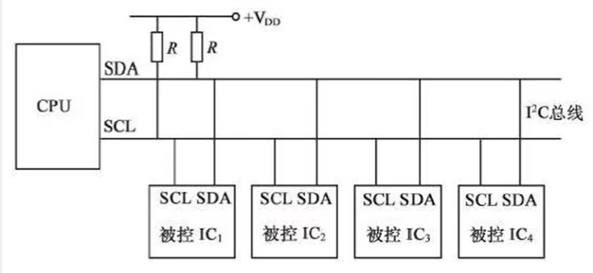

## 一、协议基础

### 1. 协议全称与来源

- **I²C**：Inter-Integrated Circuit，总线协议由 Philips（现 NXP）公司于 1980 年代开发。
- 设计目的：用于微控制器与各种外设（如 EEPROM、RTC、传感器、LCD、音频芯片等）之间**短距离通信**。

### 2. 通信方式

- **串行通信**：一根数据线传输所有信息；
- **同步通信**：数据传输受时钟同步（SCL）控制；
- **半双工**：数据可双向传输，但同一时刻只能单向；
- **主从模式**：主设备控制总线（产生起始/停止、时钟等），从设备被动响应。

------

## 二、基本结构

### 1. 信号线

- **SDA（Serial Data Line）**：数据传输线；
- **SCL（Serial Clock Line）**：时钟线，由主机控制；
- **开漏输出**：I²C 设备只能“拉低”信号线，需要外部**上拉电阻**（一般 4.7kΩ）保持高电平。

### 2. 数据格式

- 数据以 8 位字节传输，每个字节后接 1 位应答（ACK）；
- 通信开始于 **Start 条件**，结束于 **Stop 条件**；
- 每次通信都以 **主机发出地址**并等待从设备应答为起点。

### 3. 地址结构

- 7 位地址（常用）：有效地址空间 0x03~0x77；
- 10 位地址（较少）：扩展地址空间，用于特殊场合。

------

## 三、硬件连接



1.两根通讯线：SCL\SDA

2.同步，半双工

3.带数据应答

4.支持总线挂载多设备（一主多从、多主多从）

主机对SCL具有绝对的控制权

而SDA只有主机请求读取的时候，从机才能短暂的获取SCL的控制权

避免电源短路：主机和从机SCL和SDA设置弱上拉电阻+开漏输出

## 四、时序详解

起始条件：SCL高电平期间，SDA从高电平切换到低电平（下降沿）

终止条件：SCL高电平期间，SDA从低电平切换到高电平（上升沿）

发送字节（高位先行）：SCL低主机发，SCL高从机读，循环8次

接收字节（高位先行）：SCL低从机发，SCL高主机读，循环8次

发送应答（主机发）：主机接收完一个字节之后，会发一个应答位（0：应答1：非应答）

接收应答（从机发）：主机发送完一个字节之后，会接收一个应答位（0：应答1：非应答）

## 五、数据帧格式

**指定地址写（Write to Specific Register）**

用途：向从设备的指定寄存器地址写入数据

```c
数据帧格式：[S][Addr+0][ACK][RegAddr][ACK][Data][ACK]...[Data][ACK][P]
流程：
主机发送 START 条件（S）
主机发送 7位从机地址 + 写位（0）
从机返回 ACK（确认）
主机发送 寄存器地址（8位或16位）
若寄存器地址为16位，先发送高字节，再发送低字节
从机返回 ACK
主机发送 数据字节（可连续多个字节）
每个数据字节后，从机返回 ACK
主机发送 STOP 条件（P）
```

**当前地址读（Read from Current Address）**

用途：读取从设备当前指针指向的寄存器数据（无需指定地址）

```c
数据帧格式：[S][Addr+1][ACK][Data][NACK][P]
流程：
主机发送 START 条件（S）
主机发送 7位从机地址 + 读位（1）
从机返回 ACK
从机发送 数据字节
主机返回 NACK（表示停止读取）
主机发送 STOP 条件（P）
```

**指定地址读（Read from Specific Register）**

用途：先设置寄存器地址，再读取数据

```c
数据帧格式：[S][Addr+0][ACK][RegAddr][ACK][Sr][Addr+1][ACK][Data][NACK][P]
流程：
主机发送 START 条件（S）
主机发送 7位从机地址 + 写位（0）
从机返回 ACK
主机发送 寄存器地址（8位或16位）
从机返回 ACK
主机发送 重复START条件（Sr）（重启总线，不释放控制权）
主机发送 7位从机地址 + 读位（1）
从机返回 ACK
从机发送 数据字节
主机返回 NACK（停止读取）
主机发送 STOP 条件（P）
```

## 六、其他

1. 一主多从的连接方式下，==主机SCL可以配置成推挽输出，从机的SCL配置成浮空输入或者上拉输入==；数据流向是主机发送，从机接收。主从机的SDA在输入和输出之间反复切换，极力避免同时输出状态

2. 为了避免总线没协调好导致电源短路问题，I2C的设计是禁止所有设备输出强上拉的高电平，所有I2C设备的SCL连在一起，SDA连在一起，且都要设置成==开漏输出模式==；SCL和SDA各添加一个上拉电阻，阻值一般在4.7k左右$\Omega$ 

3. I2C时序基本单元

   起始条件：SCL高电平期间，SDA从高电平切换到低电平

   终止条件：SCL高电平期间，SDA从低电平切换到高电平

   所有起始终止的条件都是主机产生的

4. 发送一个字节（SCL和SDA全程由主机掌控，从机只能被动读取）低电平主机放数据，高电平从机读数据

   SCL低电平期间，主机将数据依次放到SDA上（高位先行），然后释放SCL，从机在SCL高电平期间读取数据位，所以SCL高电平期间，SDA不允许数据变化，依次循环8次即可发送一个字节

5. 同步时序之后，就算有中断，主机去处理其他事情，传输也会暂停，不会出现问题

6. 接收一个字节（主机在接收之前，需要释放SDA，让从机暂时获得控制权）低电平从机放数据，高电平主机读数据

   SCL低电平期间，从机将数据依次放到SDA上（高位先行），然后释放SCL，主机在SCL高电平期间读取数据位，所以SCL高电平期间，SDA不允许数据变化，依次循环8次即可接收一个字节

7. （主机发数据）发送应答

   主机在接收完一个字节之后，在下一个时钟发送一位数据，数据0表示应答，数据1表示非应答

8. （从机发数据）接收应答

   主机发送完一个字节之后，在下一个时钟接收一位数据，判断从机是否应答，数据0表示应答，数据1表示非应答（主机在接收之前，需要释放SDA）

9. I2C协议标准里分为7位地址和10位地址，以下讲的是7位地址，一般从机设备的地址，高位都是厂商确定的，低位可以由引脚灵活切换

10. 通过切换低位地址使每个从机设备地址都不一样


