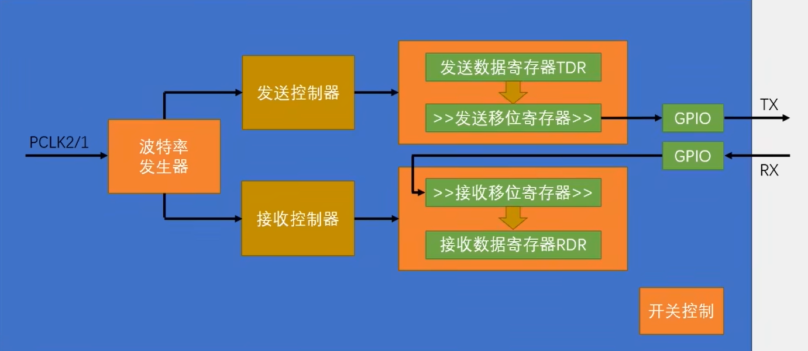

学习常用的嵌入式通信接口有以下几个基本概念要明白

1、全双工、半双工、单工

单工：只能一个设备传给另一个设备，不能反着来

半双工：只有一根数据线

全双工：有两根数据线，接收和发送互不影响

2、同步通信、异步通信

异步通信：双方时钟可以不同步，发送的信息封装（加上起始位、停止位）实现同步，效率低，用在低速传输中

同步通信：使用频率一致的时钟，数据帧通过独特的bit串作为启停标志，效率高，适合高速传输

3、波特率

数据传输速率使用波特率来表示，单位bps（bits per second）

| 总线接口 | 串/并 | 同步/异步 | 速率 | 工作方式 | 用线                      | 总线拓扑结构       | 通信距离 |
| -------- | ----- | --------- | ---- | -------- | ------------------------- | ------------------ | -------- |
| UART     | 串    | 异步      | 慢   | 全双工   | 2线(RX、TX)               | 总线型、星形、树形 | 远       |
| I2C      | 串    | 同步      | 慢   | 半双工   | 2线(SDA、SCL)             | 总线型             | 近       |
| SPI      | 串    | 同步      | 快   | 全双工   | 4线(SCLK、SIMO、SOMI、SS) | 环形               | 远       |
| USB      | 串    | 同步      | 快   | 半双工   | 4线(Vbus、GND、D+、D-)    | 星形               | 近       |

1. 常见的电平标准：
   TTL电平：+3.3v或5v表示 1， 0v表示0
   RS232电平：-3 ~ -15v表示 1，+3 ~ +15v表示 0（一般用在大型机器上面，静电干扰大，允许波动的范围很大）
   RS485电平：两线压差+2 ~ +6v表示 1，-2 ~ -6v表示0（差分信号）（半双工）

2. 每个数据帧都有起始位（固定为低电平）、数据位和停止位（固定为高电平）组成（在最后也可能有一个数据校验位，根据数据位计算而来）

3. USART全称是通用同步/异步收发器

4. 波特率 = $\frac{f_{PCLK2/1}}{16*DIV}$ 

5. STM32串口外设包括发送数据寄存器、接收数据寄存器、发送移位寄存器和接收移位寄存器。数据发送时，CPU将数据写入发送数据寄存器，数据随后通过发送移位寄存器逐位传输到TX线。接收过程相反，接收到的串行数据首先进入接收移位寄存器，再转移到接收数据寄存器，最后交给CPU。该方式为轮询模式，占用CPU资源。

6. 串口的数据格式：

   起始位（Start Bit）：通常为1位，逻辑电平为0。

   数据位（Data Bits）：通常是8位或9位，传输实际的数据。

   停止位（Stop Bit）：1位、1.5位或2位，通常为逻辑电平1。

1. 然后就需要通过中断去让CPU有空闲，一共有三类中断模式：
   **接收发送：接收数据寄存器非空中断、发送数据寄存器空中断**

   ​		 ==接收中断==：接收数据寄存器==非空==时，RXNE标志位置1，触发中断，中断处理完成，RXNE标志会自动清除

   ​		 ==发送中断==：发送数据寄存器为==空==时，TXE标志位置1，触发中断，逐个字节地将数据写入寄存器发送
   **错误检测：过载中断、帧错误中断、奇偶校验错误中断、错误中断** 

   ​		 ==过载中断==：接收到一个字符时，接收缓冲区溢出未能及时读取该字符，会触发过载中断，ORE置1，接收的数据丢失，要在中断中及时清除ORE

   ​		 ==帧错误中断==：接收数据帧格式错误时（接收器电路：起始位检测电路、数据位采样电路、停止位检测电路；时序控制电路：波特率发生器和时钟分配器生成串口通信的时钟信号，同步电路确保数据位在正确的时间点被捕获），会设置FE标志位

   ​		 ==奇偶校验错误中断==：接收的数据在设置的奇偶校验模式下校验失败，会设置PE标志位，触发中断

   ​		 ==错误中断==：发生以上多个错误时，会集中处理
   **空闲状态：空闲中断**
   ​		 ==空闲中断==：当接收缓冲区长时间没有接收到数据时，触发空闲中断，IDLE标志位被设置为1

2. 自动清除标志：TXE、RXNE、IDLE、ORE（TXE、RXNE等会在适当条件下自动清除，未及时写入数据、接收错误或溢出可能不会自动清除）

   需要手动清除标志：FE、PE